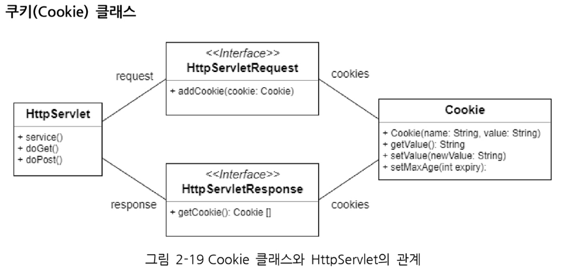

# Servlet & JSP Summary

## 쿠키
웹 서버에서 작은 양의 정보를 웹 브라우저에게 보내고, 웹 브라우저는 그 정보를 저장하고 있다가, 나중에 다시 이 웹페이지를 방문할 때 웹 서버에서 제출하도록 하는 것

> 쿠키는 클라이언트가 저장한다
- 클라이언트에 텍스트로 저장한다

쿠키는 일반적으로 세션 관리를 위해 사용된다

1. 클라이언트의 요청에 따라 웹 서버는 클라이언트에게 응답을 통해 쿠키를 부여한다
1. 쿠키가 사용자의 디스크나 웹 브라우저 메모리에 저장된다
1. 사용자가 쿠키를 부여 받은 웹사이트를 다시 요청할 때 쿠키가 전송되며 웹 서버는 해당 쿠키를 통해 클라이언트를 구별한다

- 쿠키라는 약속에 맞춰서 서버가 클라이언트에게 응답을 주면, 클라이언트인 웹 브라우저는 그 쿠키를 잘 저장하고 있다가 다음번 서버에게 요청을 보낼때 쿠키를 사용해야되는 규칙에 맞으면 쿠키를 제출

- 서버가 클라이언트에게 응답을 줄 때 HttpResponse에 쿠키를 포함해 건네주면 브라우저(클라이언트)는 다음번 그 서버에게 요청할때 HttpRequest에 쿠키를 포함해 보낸다



쿠키는 서버에서 클라이언트로 굽고, 클라이언트에서 서버로 제출하니 데이터 타입이 문자열이다.

## 세션

HTTP 프로토콜의 특성상 연속된 연결은 존재할 수 없다. ==> 연결에 대한 영속성(persistance)이 없다.

Servlet에서는 세션관리를 위한 ```HttpSession 인터페이스```를 제공

> 세션은 서버가 저장한다
- 서버가 객체타입으로 저장(서버에서 메모리에 저장해놓는 것)

인증같은 보안정보는 클라이언트에게 맡기면 수작을 부릴수도 있으니 서버가 관리하자!

세션의 처리방식
    1. 클라이언트(웹 브라우저)가 특정 도메인(웹사이트)에 요청한다.
    1. 서버는 접속한 클라이언트에 대한 세션 ID를 생성하고 세션 ID값을 저장한다
    1. 서버는 세션 ID와 함께 클라이언트에게 응답한다.
    1. 클라이언트는 세션 ID를 쿠키로 저장한다. 이때 쿠키의 이름은 jsessionId이다
    1. 클라이언트가 도메인에 재요청시 저장된 세션 ID를 서버에 넘겨준다.
    1. 서버는 클라이언트에서 받은 세션 ID를 이용하여 클라이언트를 구별한다

세션은 서버 혼자 갖고노는 데이터이기 때문에 자바객체이다.

## JSP 개요
Java Server Pages의 약어로, 웹페이지를 동적으로 처리할 수 있는 기술 중의 하나로 서블릿 프로그램의 기능을 HTML 팡리 내에 스크립트 형식으로 구현할 수 있다.
> HTML 파일 내에 스크립트 형식으로 구현

#### JSP의 처리 과정

### JSP의 스크립팅 요소(Scripting Element)
#### 스크립트릿(scriptlet)
```jsp
가장 많이 활용되는 JSP 구성 요소로서 JSP 페이지 내에서 java 코드 구현을 위해 사용한다
<% java code 작성 %>
```
#### 선언 (Declaration)
멤버변수 선언이나 메소드 선언에 사용
```jsp
<%! 속성 선언 및 method 작성 %>
```

#### 표현식 (Expression)
```jsp
<%= 출력할 값, 변수, 함수 결과 %>
```

#### 주석 (Comment)
```jsp
<%-- comment --%>
```

### JSP 기본 객체와 활성 범위
|메소드|리턴타입|설명|
|:--|:--|---|
|request|HttpServletRequest|HTML 폼 요소의 선택 값 등 사용자 입력 정보를 읽어올 때 사용|
|response|HttpServletResponse|사용자 요청에 대한 응답을 처리하기 위해 사용|
|pageContext|pageContext|각종 기본 객체를 얻거나 forward 및 include 기능을 활용할 때 사용|
|session HttpSession|클라이언트에 대한 세션 정보를 처리하기 위해 사용|
|application|ServletContext|웹 서버의 어플리케이션 처리와 관련된 정보를 참조하기 위해 사용|
|out|JspWriter|사용자에게 전달하기 위한 output 스트림을 처리할 때 사용|
|config|ServletConfig|현재 JSP에 대한 초기화 환경을 처리하기 위해 사용|
|page|java.lang.Object|현재 JSP페이지에 대한 참조 변수에 해당|


## EL ( Expression Language )

EL구문은 **${...}** 내에 표현식으로 표현

```jsp
<body>
<!-- setattribute로 보낸 데이터를 출력 -->
<!-- attribute의 키값을 적어준다 -->
서버가 준 인사는 ${greeting}
</body>
```
EL 표현식
- 문자
    - ${true}
    - ${false}
    - ${123}
    - ${3.14}
    - ${"JAVA"}
    - ${'java'}

- EL연산자
    - 산술연산자 : +, -, *, /, %, mode
    - 논리연산자 : &&, ||, !, and, or, not
    - 비교연산자 : ==, !=, <, >, <=, >=, eq, ne, lt, get, le, ge
    - empty연사자 : 값이 null이거나 공백문자인지를 판단하는 연산자 ${empty ""} -> true
    - ${empty null} -> true


## JSTL (Java Standard Library)
JSTL.jar 파일이 필요 (mvnrepository) ==> maven library

maven ( 빌드 관리 도구; build management tool )

JSTL은 조건문과 반복문을 대체할 if, foreach태그를 사용하기 위함

스크립틀릿을 다시 열어 조건을 작성하는 것보다. JSTL의 IF태그를 쓰는게 훨씬 가독성도 좋고 이질감이 덜하다
```jsp
<!-- jstl의 core태그를 사용하기 위한 선언 -->
<%@ taglib prefix="c"   uri="http://java.sun.com/jsp/jstl/core" %>
<c:if test= "expression" var ="name" scope="scope">
body content
</c:if>

<c:out value="print this"></c:out>

<!-- if else -->
<c:choose></c:choose>
<!-- for each -->
<c:forEach items="attr에들어있는 배열, 리스트" var = "임시변수">
${임시변수}
</c:forEach>
```

core library : c태그
choose if foreach 태그