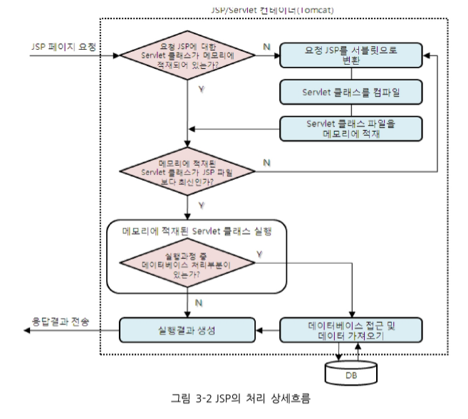
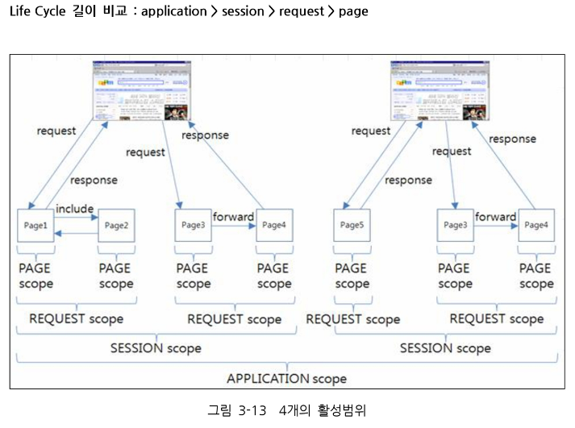

# Servlet & JSP Summary

## JSP 개요
Java Server Pages의 약어로, 웹페이지를 동적으로 처리할 수 있는 기술 중의 하나로 서블릿 프로그램의 기능을 HTML 팡리 내에 스크립트 형식으로 구현할 수 있다.
> HTML 파일 내에 스크립트 형식으로 구현

### JSP의 LifeCycle


### JSP의 활성범위(Scope)
| Scope(활성범위) | 연관 기본 객체    | 생성시기                          | 소멸시기                              |
| ----------- | ----------- | ----------------------------- | --------------------------------- |
| page        | pageContext | JSP 페이지 처리시작                  | JSP페이지 처리 완료                      |
| request     | request     | 웹 브라우저부터 요청처리 시작              | 웹 브라우저로 응답 완료                     |
| session     | session     | 웹 브라우저부터의 첫번째 요청 처리 시작        | 세션 타이머가 만료되거나 명시적으로 세션을 소멸시킬 때 소멸 |
| application | application | Tomcat의 구동과 함께 웹 애플리케이션의 첫 시작 | Tomcat 서버의 종료                     |



#### JSP의 처리 과정

### JSP의 스크립팅 요소(Scripting Element)
#### 스크립트릿(scriptlet)
```jsp
가장 많이 활용되는 JSP 구성 요소로서 JSP 페이지 내에서 java 코드 구현을 위해 사용한다
<% java code 작성 %>
```
#### 선언 (Declaration)
멤버변수 선언이나 메소드 선언에 사용
```jsp
<%! 속성 선언 및 method 작성 %>
```

#### 표현식 (Expression)
```jsp
<%= 출력할 값, 변수, 함수 결과 %>
```

#### 주석 (Comment)
```jsp
<%-- comment --%>
```

### JSP 기본 객체와 활성 범위
- JSP의 내장 객체 : 밑의 객체들은 프로그램이 자동으로 new를 사용해 선언한다

| 메소드                 | 리턴타입                        | 설명                                           |
| :------------------ | :-------------------------- | -------------------------------------------- |
| request             | HttpServletRequest          | HTML 폼 요소의 선택 값 등 사용자 입력 정보를 읽어올 때 사용        |
| response            | HttpServletResponse         | 사용자 요청에 대한 응답을 처리하기 위해 사용                    |
| pageContext         | pageContext                 | 각종 기본 객체를 얻거나 forward 및 include 기능을 활용할 때 사용 |
| session HttpSession | 클라이언트에 대한 세션 정보를 처리하기 위해 사용 |
| application         | ServletContext              | 웹 서버의 어플리케이션 처리와 관련된 정보를 참조하기 위해 사용          |
| out                 | JspWriter                   | 사용자에게 전달하기 위한 output 스트림을 처리할 때 사용           |
| config              | ServletConfig               | 현재 JSP에 대한 초기화 환경을 처리하기 위해 사용                |
| page                | java.lang.Object            | 현재 JSP페이지에 대한 참조 변수에 해당(범위가 가장 작음)           |


## EL ( Expression Language )

EL구문은 **${...}** 내에 표현식으로 표현

```jsp
<body>
<!-- setattribute로 보낸 데이터를 출력 -->
<!-- attribute의 키값을 적어준다 -->
서버가 준 인사는 ${greeting}
</body>
```
EL 표현식
- 문자
    - ${true}
    - ${false}
    - ${123}
    - ${3.14}
    - ${"JAVA"}
    - ${'java'}

- EL연산자
    - 산술연산자 : +, -, *, /, %, mode
    - 논리연산자 : &&, ||, !, and, or, not
    - 비교연산자 : ==, !=, <, >, <=, >=, eq, ne, lt, get, le, ge
    - empty연사자 : 값이 null이거나 공백문자인지를 판단하는 연산자 ${empty ""} -> true
    - ${empty null} -> true


## JSTL (Java Standard Library)
JSTL.jar 파일이 필요 (mvnrepository) ==> maven library

maven ( 빌드 관리 도구; build management tool )

JSTL은 조건문과 반복문을 대체할 if, foreach태그를 사용하기 위함

스크립틀릿을 다시 열어 조건을 작성하는 것보다. JSTL의 IF태그를 쓰는게 훨씬 가독성도 좋고 이질감이 덜하다
자바를 모르는 사람도 쉽게 JSP를 사용할 수 있다.
```jsp
<!-- jstl의 core태그를 사용하기 위한 선언 -->
<!-- page Directive -->
<%@ taglib prefix="c"   uri="http://java.sun.com/jsp/jstl/core" %>
<!-- test안의 내용이 참 거짓인지 판단해 실행여부를 판단한다 -->
<c:if test= "expression" var ="name" scope="scope">
body content
</c:if>

<!-- 기본 출력 -->
<c:out value="print this"></c:out>


<!-- if else -->
<c:choose>
    <!-- if -->
    <c:when>
    </c:when>
    <!-- else if -->
    <c:when>
    </c:when>
    <!-- else -->
    <c:otherwise>
    </c:otherwise>
</c:choose>


<!-- for each -->
<c:forEach items="attr에들어있는 배열, 리스트" var = "임시변수">
${임시변수} <!-- 리스트내의 요소를 임시변수로 가져온다 -->
</c:forEach>
```

core library : c태그
choose if foreach 태그

## 지시자(Directive) 태그
### 태그의 종류
#### page Directive
컨테이너에게 현재 JSP페이지를 어떻게 처리할 것인가에 대한 정보를 제공하는데 사용

```JSP
<%@ page contentType="text/html; charset=utf-8" %>
```
#### include Directive
여러 JSP페이지에서 공통적인 내용이 있을 때 매번 공통적인 내용을 작성하지 않고 파일로 저장한 후 필요할 때 JSP페이지에서 파일을 삽입하여 사용할 수 있다.
두개의 JSP를 합쳐서 하나의 JSP로 메모리상에 만든 후 서블릿으로 만든다.

```JSP
<%@ include file="header.jsp" %>
```

- JSTL의 include와 차이
    JSTL은 두개의 JSP파일을 따로 컴파일 한 후 사용 --> 각 파일의 변수명이 겹쳐도 된다.

#### taglib Directive
사용자에 의해서 만든 커스텀 태그(custom tag)를 이용할 때 사용되며 JSP 페이지 내에 불필요한 자바 코드를 줄일 수 있다.

```JSP
<%@ taglib uri="/WEB-INF/taglib.tld" prefix="soccer" %>
```

### Page Directive의 속성(Attribute)
|     속성      | 설명                                                                                                                             | 사용빈도  | 기본값                           |
| :---------: | ------------------------------------------------------------------------------------------------------------------------------ | ----- | ----------------------------- |
| contentType | 브라우저로 내보내는 MIME 형식 지정 및 문자 집합 지정                                                                                               | 매우 높음 | text/html; charset=ISO-8859-1 |
|   import    | 현재 JSP 페이지에서 사용할 Java 패키지나 클래스를 지정                                                                                             | 높음    |                               |
|  errorPage  | 에러가 발생할 때에 대신 처리될 JSP 페이지 지정                                                                                                   | 높음    |                               |
| isErrorPage | 현재 JSP페이지가 에러 핸들링 하는 페이지인지 지정하는 요소<br>`true`일 경우 exception 내장객체를 통해 error 정보를 알 수 있다.<br>`false`일 경우 exception 내장객체를 사용할 수 없다. | 높음    | false                         |


## JSP 액션태그
- <jsp:include /> : 지정한 페이지를 태그가 위치한 부분에 포함시킬 때 사용되는 태그
- <jsp:forward /> : forward 태그는 다른 페이지로 이동할 때 사용되는 태그
- <jsp:param /> : 요청한 페이지로 정보를 전달할 때 사용하는 태그
- <jsp:useBean /> : JavaBean 객체를 생성 및 사용하기 위한 태그
- <jsp:setProperty /> : JavaBean 객체 생성시 객체의 필드에 값을 주는 태그
- <jsp:getProperty /> : JavaBean 객체의 필드값을 얻어올 때 사용하는 태그

### 에러페이지 지정
- page 지시문 및 errorPage와 isErrorPage 속성을 활용한 에러 페이지 지정
- web.xml의 <error-code>태그를 활용한 HTTP 에러 코드별 에러 페이지 지정
- web.xml의 <exception-type>태그를 활용한 Java 고유의 예외 종류벌 에러 페이지 지정

## EL (Expression Language)

### EL 내장객체
EL은 자동으로 id를 찾아준다 ( 가장 작은 scope 부터 찾아본다 ) -> 중복된다면 가장 작은 범위의 값을 가져오게 된다

| Category | 식별자              | 설명                                                                |
| -------- | ---------------- | ----------------------------------------------------------------- |
| JSP      | pageContext      | 현재 페이지의 프로세싱과 상응하는 PageContext인스턴스                                |
| 범위       | pageScope        | page scope에 저장된 객체를 추출해서 출력할 때 사용                                 |
|          | requestScope     | request scope에 저장된 객체를 추출해서 출력할 때 사용                              |
|          | sessionScope      | session scope에 저장된 객체를 추출해서 출력할 때 사용                              |
|          | applicationScope | application scope에 저장된 객체를 추출해서 출력할 때 사용                          |
| 요청 매개변수  | param            | ServletRequest.getParameter(String)을 통해 요청 정보를 추출할 때 사용           |
|          | paramValues      | ServletRequest.getParameterValues(String)를 통해 요청 정보를 추출할 때 사용     |
| 요청헤더     | header           | HttpServletRequest.getHeader(String)를 통해 헤더 정보를 추출할 때 사용          |
|          | headerValues     | HttpServlerRequest.getHeaders(String)를 통해 헤더 정보를 추출할 때 사용         |
| 쿠키       | cookie           | HttpServlerRequest.getCookie(String)를 통해 Cookie 정보를 추출할 때 사용      |
| 초기화 매개변수 | initParam        | ServletContext.getInitParameter(String)를 통해 초기화 파라미터 정보를 추출할 때 사용 |


