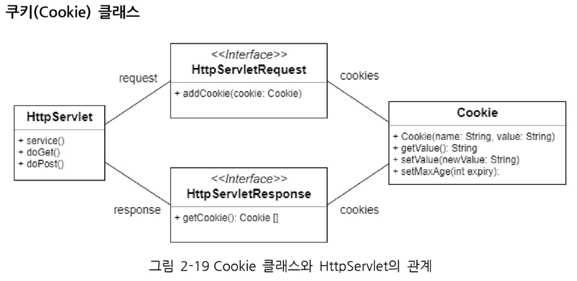

# Servlet

## 요청 & 응답
request와 response는 한번의 요청과 응답이 끝나면 사라진다.

좀더 길게 유지하고 싶을 때 -- 세션(Session)을 사용


> 데이터의 유지 시간
>> request&response < session < servletContext

### 세션
데이터 저장 위치 : 서버 (서버의 메모리상에 저장)
기본 유지 시간 : 브라우저가 꺼질때 까지 유지된다

```java
HttpSession session = request.getSession();
session.setAttribute("id","data");
```
주로 로그인 정보 저장에 사용한다 : 접속이 끊기면 로그아웃 되기 때문에

### 쿠키
유지가 필요하나 서버에 저장해 유지하기 힘들때 사용

### ServletContext
Application Setting을 저장


## 쿠키
웹 서버에서 작은 양의 정보를 웹 브라우저에게 보내고, 웹 브라우저는 그 정보를 저장하고 있다가, 나중에 다시 이 웹페이지를 방문할 때 웹 서버에서 제출하도록 하는 것

> 쿠키는 클라이언트가 저장한다
- 클라이언트에 텍스트로 저장한다

쿠키는 일반적으로 세션 관리를 위해 사용된다

1. 클라이언트의 요청에 따라 웹 서버는 클라이언트에게 응답을 통해 쿠키를 부여한다
1. 쿠키가 사용자의 디스크나 웹 브라우저 메모리에 저장된다
1. 사용자가 쿠키를 부여 받은 웹사이트를 다시 요청할 때 쿠키가 전송되며 웹 서버는 해당 쿠키를 통해 클라이언트를 구별한다

- 쿠키라는 약속에 맞춰서 서버가 클라이언트에게 응답을 주면, 클라이언트인 웹 브라우저는 그 쿠키를 잘 저장하고 있다가 다음번 서버에게 요청을 보낼때 쿠키를 사용해야되는 규칙에 맞으면 쿠키를 제출

- 서버가 클라이언트에게 응답을 줄 때 HttpResponse에 쿠키를 포함해 건네주면 브라우저(클라이언트)는 다음번 그 서버에게 요청할때 HttpRequest에 쿠키를 포함해 보낸다



쿠키는 서버에서 클라이언트로 굽고, 클라이언트에서 서버로 제출하니 데이터 타입이 문자열이다.

## 세션

HTTP 프로토콜의 특성상 연속된 연결은 존재할 수 없다. ==> 연결에 대한 영속성(persistance)이 없다.

브라우저가 접속할 때, 자동으로 새로운 세션을 생성하며, 그에 대한 결과로 key를 브라우저로 전송한다.
브라우저는 이 key를 쿠키로 저장해놓는다 ( 이 key는 JSESSIONID로 저장이 된다 )

> 브라우저 단에서 쿠키를 저장하지 않으면 세션도 생성할 수 없다.

Servlet에서는 세션관리를 위한 ```HttpSession 인터페이스```를 제공

> 세션은 서버가 저장한다
- 서버가 객체타입으로 저장(서버에서 메모리에 저장해놓는 것)

인증같은 보안정보는 클라이언트에게 맡기면 수작을 부릴수도 있으니 서버가 관리하자!

세션의 처리방식
    1. 클라이언트(웹 브라우저)가 특정 도메인(웹사이트)에 요청한다.
    1. 서버는 접속한 클라이언트에 대한 세션 ID를 생성하고 세션 ID값을 저장한다
    1. 서버는 세션 ID와 함께 클라이언트에게 응답한다.
    1. 클라이언트는 세션 ID를 쿠키로 저장한다. 이때 쿠키의 이름은 jsessionId이다
    1. 클라이언트가 도메인에 재요청시 저장된 세션 ID를 서버에 넘겨준다.
    1. 서버는 클라이언트에서 받은 세션 ID를 이용하여 클라이언트를 구별한다

세션은 서버 혼자 갖고노는 데이터이기 때문에 자바객체이다.