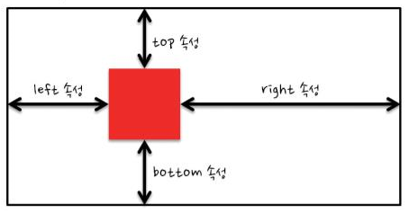

# HTML & CSS Summary Week1
## HTML
### Sementic Markup
태그로 화면구성을 하기위해 만들어졌다<br>
기존의 화면 구성 방식 (div등을 이용한 화면구성 / p태그를 이용한 화면구성)이 아닌, 각 요소에 맞는 태그를 이용하는 HTML화면 구성 방식이다.

### Tags

|태그|설명|
|:--:|--|
|img|src 속성이 꼭 필요하다|
|a|href속성에 작성된 주소로 연결해주는 태그|
|form|action속성에 주소값을 주면, 해당 주소에 접속한다. method속성을 통해 `GET,POST`방식중 하나를 이용해 전송하게 된다. form안 자식태그의 인자값들을 한꺼번에 전송|


### 통신 방식
GET : 주소창을 통해 서버에 요청하는 방식 ( 주소창에 모든 변수의 이름과 값이 나타나게 된다 )
POST


### grouping 시
inline level markup : span ==> 개행이 일어나지 않는 태그
block level markup : div    ==> 개행이 일어나는 태그


### 태그는 의미별로 종류를 나타낼 수 있다.
전송과 관련된, 관련되지 않은
block level & inline level
시멘틱 & non 시멘틱

## CSS
### 선택자

```css
h1 { color : red; }
/* 선택자 { 스타일 속성 : 스타일 값 } */
```

### 속성 선택자
|선택자 형태|설명|
|---|---|
|선택자[속성]|특정한 속성이 있는 태그를 선택합니다|
|선택자[속성=값][속성=값]|특정한 속성 안의 값이 특정 값과 같은 문서 객체를 선택합니다|

### 문자열 속성 선택자
- 태그가 가지고 있는 속성의 특정한 문자열을 확인한다

|선택자 형태|설명|
|---|---|
|선택자[속성~=값]|속성 안의 값이 특정 값을 단어로 포함하는 태그를 선택합니다.|
|선택자[속성|=값]|속성 안의 값이 특정 값을 단어로 포함하는 태그를 선택합니다.|
|선택자[속성^=값]|속성 안의 값이 특정 값으로 `시작하는` 태그를 선택합니다.|
|선택자[속성$=값]|속성 안의 값이 특정 값으로 `끝나는` 태그를 선택합니다.|
|선택자[속성*|*=값]|속성 안의 값이 특정 값을 `포함하는` 태그를 선택합니다.|

### 후손 / 자손 선택자
- 특정한 태그 아래에 있는 후손을 선택할 때 사용하는 선택자

#### 후손 선택자
|선택자 형태|설명|
|---|---|
|선택자A 선택자B|선택자A의 후손에 위치하는 선택자B를 선택합니다.|

```css
/* id 속성값으로 header를 가지는 태그의 후손위치에 있는 h1태그의 color 속성에 키워드를 적용합니다. */
#header h1 { color:red; }

/* id 속성값으로 section을 가지는 태그의 후손 위치에 있는 h1태그의 color 속성에 orange 키워드를 적용합니다. */
#section h1 { color:orange; }
```

#### 자손 선택자
- 특정한 태그 아래에 있는 자손을 선택할 때 사용하는 선택자

|선택자 형태|설명|
|---|---|
|선택자A > 선택자B|선택자A의 자손에 위치하는 선택자B를 선택합니다.|

```css
/* 자손 선택자의 사용 */
/* id 속성값으로 header를 가지는 태그의 위치에 있는 h1 태그의 color속성에 red키워드를 적용합니다. */
#header > h1 { color:red; }

/* id 속성값으로 section을 가지는 태그의 자손 위치에 있는 h1태그의 color 속성에 orange 키워드를 적용합니다 */
#section > h1 { color : orange; }
```

#### 동위 선택자
- 동위 관계에서 뒤에 위치한 태그를 선택할 때 사용하는 선택자이다.

|선택자 형태|설명|
|---|---|
|선택자A + 선택자B|선택자A의 바로 뒤에 위치하는 선택자B를 선택합니다.|
|선택자A ~ 선택자B|선택자A의 뒤에 위치하는 선택자B를 선택합니다.|

```css
/* h1 태그 바로 뒤에 위치하는 h2 태그의 color 속성에 red 키워드를 적용 */
h1 + h2 { color : red; }

/* h1 태그 뒤에 위치하는 h2태그의 background-color 속성에 orange 키워드를 적용 */
h1 ~ h2 { background-color : orange; }
```

#### 반응 선택자
- 사용자의 반응으로 생성되는 특정한 상태를 선택하는 선택자
- 사용자가 마우스를 특정한 태그위에 올리면 hover상태가 적용, 클릭하면 active상태가 적용

|선택자 형태|설명|
|---|---|
|:active|사용자가 마우스로 클릭한 태그를 선택|
|:hover|사용자가 마우스를 올린 태그를 선택|

```css
/* hover이벤트가 발생하면 h1태그가 red로 바뀐다 */
h1:hover {color:red;}
```

#### 상태 선택자

|선택자 형태|설명|
|---|---|
|:checked|체크 상태의 input 태그를 선택|
|:focus|초점이 맞추어진 input 태그를 선택|
|:enabled|사용 가능한 input 태그를 선택|
|:disabled|사용 불가능한 input 태그를 선택|


### 구조 선택자
- 구조 선택자는 CSS3 부터 지원하는 선택자이다.
- 일반적으로 `자손 선택자와 병행`해서 많이 사용한다.

##### 일반 구조 선택자
- 일반 구조 선택자는 특정한 위치에 있는 태그를 선택하는 선택자이다.

|선택자 형태|설명|
|---|---|
|:first-child|형제 관계 중에서 첫 번째에 위치하는 태그를 선택합니다.|
|:last-child|형제 관계 중에서 마지막에 위치하는 태그를 선택합니다.|
|:nth-child(수열)|형제 관계 중에서 **앞에서 수열 번째**에 태그를 선택합니다.|
|:nth-last-child(수열)|형제 관계 중에서 **뒤에서 수열 번째**에 태그를 선택합니다.|

```css
/* 리스트에서 짝수번째 리스트를 선택해 배경색을 변경 */
li:nth-child(2n) { background-color:#FF0003; }
/* 리스트에서 홀수번째 리스트를 선택해 배경색을 변경 */
li:nth-child(2n+1) { background-color:#800000; }
```

#### 형태 구조 선택자
- 형태 구조 선택자는 일반 구조 선택자와 비슷하지만 **태그 형태를 구분**한다.

|선택자 형태|설명|
|---|---|
|:first-of-type|형제 관계 중에서 첫 번째로 등장하는 특정 태그를 선택|
|:last-of-type|형제 관계 중에서 마지막으로 등장하는 특정 태그를 선택|
|:nth-of-type|형제 관계 중에서 앞에서 수열 번째로 등장하는 특정 태그를 선택|
|:nth-last-of-type|형제 관계 중에서 뒤에서 수열 번째로 등장하는 특정 태그를 선택|


#### 문자 선택자
- 문자 선택자는 태그 내부의 특정한 조건의 문자를 선택하는 선택자

##### 시작 문자 선택자
- 시작 문자 선택자는 태그 내부의 첫 번째 글자나 첫 번째 줄을 선택할 때 사용하는 선택자

|선택자 형태|설명|
|---|---|
|::first-letter|첫 번째 글자를 선택합니다|
|::first-line|첫 번째 줄을 선택합니다|

##### 반응 문자 선택자
|선택자 형태|설명|
|---|---|
|::selection|사용자가 드래그한 글자를 선택합니다.|

#### 링크 선택자
|선택자 형태|설명|
|---|---|
|:link|href 속성을 가지고 있는 a태그를 선택|
|:visited|방문했던 링크를 가지고 있는 a 태그를 선택|

```css
/* 텍스트 데코레이션을 없앤다 */
a { text-decoration : none; }
a:visited { color : red; }

/* href 속성을 갖고 있는 a 태그 뒤의 공간에 "- (href 속성)"을 추가합니다 */
a:link::after { content : ' - ' attr(href); }
```

#### 부정 선택자
- 부정 선택자는 지금까지 배운 선택자를 모두 반대로 적용할 수 있게 만드는 서택자이다

|선택자 형태|설명|
|---|---|
|:not(선택자)|선택자를 반대로 적용합니다|

```css
/* input 태그 중에서 type 속성값이 password가 아닌 태그의 background 속서엥 red 키워드를 적용합니다 */
input:not([type=password]){
    background : red;
}
```

### CSS3 단위
#### 크기 단위
가장 많이 사용하는 단위는 %, em, px이다.
- %를 사용하는것이 매우 좋으며, 가장 안좋은 방식은 px이다. ==> 화면 해상도가 모두 다르기 때문에

#### 색상 단위
- 색상을 적용하는 가장 기본 방법은 키워드를 사용하는 것이다.

|단위 형태|설명|
|---|---|
|#000000|HEX 코드 단위|
|rgb(red, green, blue)|RGB 색상 단위|
|rgba(red, green, blue, alpha)|RGBA 색상 단위|
|hsl(hue, saturation, lightness)|HSL 색상 단위|
|hsla(hue, saturation, lightness, alpha)|HSLA 색상 단위|

#### 가시 속성
##### dispaly 속성
- display 속성은 태그의 영역 표현 방식을 지정하는 속성

|키워드 이름|설명|기타|
|---|---|---|
|none|태그를 화면에서 보이지 않게 만듭니다||
|block|태그를 block 형식으로 지정합니다||
|inline|태그를 inline 형식으로 지정합니다|margin과 padding이 좌우로만 적용됨|
|inline-block|태그를 inline-block 형식으로 지정합니다|margin과 padding이 상,하,좌,우 모두 적용됨|

##### visibility 속성

|키워드 이름|설명|기타|
|---|---|---|
|visible|태그를 보이게 만든다||
|hidden|태그를 보이지 않게 만든다|영역은 유지한 채로 보이지 않게만 만든다|
|collapse|table 태그를 보이지 않게 만든다||

- display:none 과 visibility:false의 차이점
    - visibility = false 자리를 차지는 하나 보이지 않는다.
    - none : 자리를 차지하지 않는다


##### opacity 속성
- 대상의 투명도를 지정하는 속성
- 0부터 1 사이의 숫자를 입력한다 (0은 투명, 1은 불투명)

```css
#box{
    background-color:black;
    color: white;
    opacity:0.2;
}
```

#### 박스 속성
- 웹 페이지의 레이아웃을 구성할 때 가장 중요한 속성
- margin, border, padding, height, width 속성들을 합쳐 박스속성이라 한다

##### width / height 속성
- 글자를 감싸는 영역의 크기를 지정

```css
div {
    width: 100px; height: 10px;
    background-color:red;
}
```

##### margin / padding 속성
- margin 속성은 마진의 너비를 지정하는 속성이고, padding 속성은 패딩의 너비를 지정하는 속성

```css
div {
    width: 100px; height: 100px;
    background-color:red;

    border: 20px solid black;
    margin: 10px; padding:30px;
}
```

#### border-radius 속성
- 테두리가 둥근 사각형 또는 원을 만들 수 있다.
- 각각의 테두리의 둥글기를 설정할 수도 있다.

```css
.box {
    border : thick dashed black;
    border-radius: 20px;

    /* border-radius: 왼쪽 위, 오른쪽 위, 오른쪽 아래, 왼쪽 아래 */
    border-radius: 50px 40px 20px 10px;
}
```

#### 폰트 속성
##### font-size 속성
- 글자의 크기를 지정할 때에 사용하는 속성이다.

```css
.a { font-size: 32px; }
.b { font-size: 2em; }
.c { font-size: large; }
.d { font-size: small; }
```

##### font-family 속성
- 폰트를 지정하는 속성
- 폰트 이름을 입력해서 사용한다.

```css
.font_arial { font-family:Arial }
.font_roman { font-family: 'Times New Roman' }
```

- 사용자의 컴퓨터에 폰트가 없으면 폰트가 적용되지 않는다
- 만약을 대비해 여러 개의 폰트를 연속적으로 입력한다
- 하지만 다국적 웹 페이지를 제공할 경우 사용자에게 무슨 폰트가 있는지 일일이 확인할 수 없다
- 이러한 경우에는 generic-family 폰트를 사용한다
- generic-family 폰트는 웹 브라우저에서 미리 지정하고 있는 폰트이다

### 위치 속성
#### posisition 속성
- 태그의 위치 설정 방법을 변경할 때 사용한다

|키워드|설명|기타|
|---|---|---|
|static|태그가 위에서 아래로 순서대로 배치됩니다|default값|
|relative|초기위치상태에서 상하좌우로 위치를 이동합니다|
|absolute|절대 위치 좌표를 설정합니다|
|fixed|**화면을 기준**으로 절대 좌표를 설정합니다|

static과 fixed는 다른 레이어에 존재한다

```css
.box{
    width: 100px; height:100px;
    position: absolute;
}
.box:nth-child(1){
    background-color:red;
    left: 10px; top : 10px;
}
```


#### z-index 속성
- HTML 태그는 아래 입력한 태그가 위로 올라온다
- 이러한 순서를 변경할 때에 z-index 속성을 사용한다
- 큰 값을 입력할 수록 위로 올라온다

```css
.box:nth-child(1){
    background-color:red;
    left : 10px; top:10px;

    z-index:100
}
```

fixed와 absolute는 서로 다른 레이어에 그려진다<br>
fixed 속성은 화면기준으로 좌표를 설정 (스크롤 시 따라올라가지 않음)
absolute 속성은 도큐먼트 기준으로 설정 (스크롤에 따라가나, z-index를 통해 레이어 순서를 정해줄 수 있다; z-index가 높을수록 위에 그려진다)

#### overflow 속성
|키워드 이름|설명|
|---|---|
|hidden|영역을 벗어나는 부분을 보이지 않게 만듭니다|
|scroll|영역을 벗나는 부분을 스크롤로 만듭니다|

#### float 속성
- 웹페이지 레이아웃을 구성할 때에 반드시 사용하는 속성
- 부유하는 대상을 만들 때에 사용하는 속성이다
- 형제관계끼리 충돌이 생겨 개행이 생긴다 (float 레이어가 있다고 생각하자)

|키워드 이름|설명|기타|
|---|---|
|left|태그를 왼쪽에 붙입니다||
|right|태그를 오른쪽에 붙입니다|right 키워드를 적용했을 경우에는 **위에 위치한 태그가 오른쪽**에 붙는다는 것을 주의|


### 반응형 웹디자인
```css
/*  */
@media screen and (max-width:720px){
    #nav, #content{
        float:none;
        /* ... */
    }
}
```