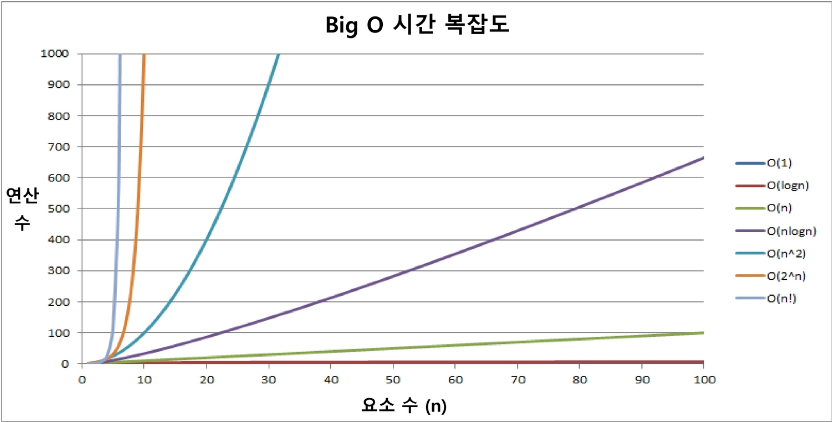

# 알고리즘

### 무엇이 좋은 알고리즘인가?
- 정확성 : 얼마나 정확하게 동작하는가
- 작업량 : 얼마나 적은 연산으로 원하는 결과를 얻어내는가 (시간 복잡도)
- 메모리 사용량 : 얼마나 적은 메모리를 사용하는가
- 단순성 : 얼마나 단순한가
- 최적성 : 더 이상 개선할 여지없이 최적화되있는가

##### 시간복잡도
- 실제 걸리는 시간을 측정 ( 실행 환경에 따라 상대적 )
- **실행되는 명령문의 개수를 계산**
  
 **Big-O**</img>

> 시간복잡도 ≒ 빅-오(O) 표기법

- 시간 복잡도 함수 중에서 가장 큰 영향력을 주는 n에 대해서만 표시
- 계수(Conefficient)는 생략하여 표시

**제한시간 2초 : 1억번 정도의 명령행은 괜찮다** 
- O(n!) : n -> 12까지 허용
- O(2^n) : n -> 20 까지 허용
- O(n^2) : n -> 10000 ~ 50000 허용

##### 배열
- 한번에 접근하기에 유리하다 ( 연속된 공간에 있기 때문에 )
- 배열을 사용하면 하나의 선언을 통해, 둘 이상의 변수를 선언할 수 있다.
- 단순히 다수의 변수 선언을 의미하는 것이 아니라, 다수의 변수
로 하기 힘든 작업을 배열을 활용해 쉽게 할 수 있다.

##### 클래스
- 관련있는 변수와 함수를 묶어 만든 사용자 정의 변수형
- 기초자료형이 아니므로 항상 `new`를 이용하여 할당해주어야 한다

  
# 정렬
- 정렬 : 두개 이상의 자료를 특정 기준에 의해 작은 값부터 큰 값(오름차순 : Ascending), 혹은 그 반대로 순서대로(내림차순 : Descending) 재배열 하는 것
- 키 : 자료를 정렬하는 기준이 되는 특정 값

#### 선택 정렬

#### 버블 정렬

#### 완전 탐색
- 모든 경우의수를 늘어놓고 확인하는 방법

#### 탐욕 알고리즘
- 최적해를 구하는 데 사용되는 근시안적인 방법
- 여러 경우 중 하나를 결정해야 할 때마다 그 순간에 최적이라고 생각되는 것을 선택해 나가는 방식으로 진행하여 최종적인 해답에 도달한다
- 각 선택의 시점에서 이루어지는 결정은 지역적으로는 최적이지만, 그 선택들을 계속 수집하여 최정적인 해답을 만들었다고 하여, 그것이 최적이라는 보장은 없다.
- 일반적으로, 머릿속에 떠오르는 생각을 검증 없이 바로 구현하면 Greedy 접근이 된다

#### 완전 검색으로 시작하라
- 모든 경우의 수를 생성하고 테스트하기 때문에 수행 속도는 느리지만, 해답을 찾아내지 못할 확률이 작다.
- 우선 완전검색으로 접근하여 해답을 도출한 후, 성능 개선을 위해 다른 알고리즘을 사용하고 해답을 확인하는 것이 바람직