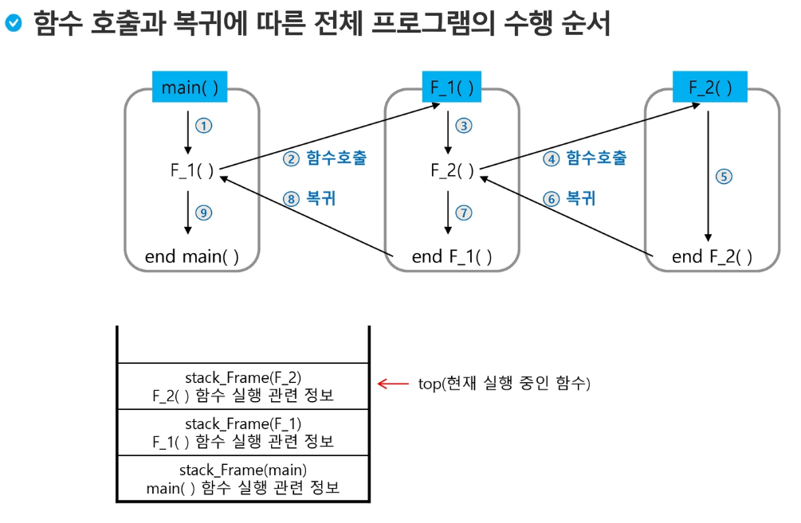

# Algorithm Summary Week3

## 문자열(String)

#### 인코딩이란?
- Encode + ing : 부호화 하다, 코드화 하다 라는 뜻을 가진다.
- 달리 말하면, 어떠한 것을 협의된 약속에 맞게 변환시키는 과정을 뜻한다
- 반의어 : Decoding(디코딩; 코드화 한 것을 원래의 모습으로 변환시키는 과정)

> 오늘날 대부분의 컴퓨터는 문자를 읽고 쓰는데 ASCII형식을 사용한다.

### 유니코드
인터넷이 발달해 국가간 통신을 할 때, 파편화된 코드체계로 인해 해석에 문제가 생기기 시작하였다.<br>

이러한 문제를 해결하기 위해 다국어 처리를 위한 표준을 만들었고, 이를 `유니코드`라 한다.

## 스택 (Stack)
LIFO(Last In First Out)특성을 가지는 자료구조

정적으로 구현할 때는 배열을 이용하고, 동적으로 구현할때는 리스트 등을 이용할 수 있다.

자바에서는 기본적으로 제공되는 `stack`이 있다

```java
public class Stack<E> extends Vector<E>
```
위 코드에서 알 수 있듯이, 기본 제공되는 스택은 제너릭으로 구현되어 있으며, Vector<E> 클래스를 상속받는다.

|Member Method|Function|
|:--:|:--:|
|push(E item)|item을 스택에 추가|
|pop()|top 값을 반환, 후 해당 값을 제거|
|peek()|top의 값을 리턴한다. top의 값의 변화가 없다|
|empty()|스택이 비었는지 여부를 리턴|
|serach(Obejct o)|data의 보관한 순번 반환(1부터 시작)|


### Function Call
- 프로그램에서의 함수 호출과 복귀에 따른 수행순서를 관리
    - 가장 마지막에 호출된 함수가 가장 먼저 실행을 완료하고 복귀하는 후입선출 구조이므로, 후입선출 구조의 스택을 이용하여 수행순서 관리
    - 함수 호출이 발생하면 호출한 함수 수행에 필요한 지역변수, 매개변수 및 수행 후 복귀할 주소 등의 정보를 스택 프레임(Stack Frame)에 저장하여 시스템 스택에 삽입
    - 함수 실행이 끝나면 시스템 스택의 top원소(스택 프레임)를 삭제(pop)하면서 프레임에 저장되어 있던 복귀주소를 확인하고 복귀
    - 함수 호출과 복귀에 따라 이 과정을 반복하여 전체 프로그램 수행이 종료되면 시스템 스택은 공백 스택이 된다.



### 재귀 호출 (Recursive Call)
- 자기 자신을 호출하여 순환 수행되는 것
- 함수에서 실행해야 하는 작업의 특성에 따라 일반적인 호출방식보다 재귀호출 방식을 사용하여 함수를 만들면 프로그램 크기를 줄이고 간단하게 작성

```
재귀호출의 예) factorial
n! = n x (n-1)!
    (n-1)! = (n-1) x (n-2)!
    (n-2)! = (n-2) x (n-3)!
...
    2! = 2 x 1
    1! = 1
```
- 마지막에 구한 하위 값을 이용하여 상위값을 구하는 작업을 반복

### Memoization
- 메모이제이션(Memoization)은 컴퓨터 프로그램을 실행할 때 이전에 계산한 값을 메모리에 저장해서 매번 다시 계산하지 않도록 하여 전체적인 실행속도를 빠르게 하는 기술이다. `동적 계획법의 핵심이 되는 기술`이다

### DP(Dynamic Programming)
- 동적계획(Dynamic Programming) 알고리즘은 그리디 알고리즘과 같이 `최적화 문제`를 해결하는 알고리즘이다.

- 동적 계획 알고리즘은 먼저 크기가 작은 부분 문제들을 모두 해결한 후에 그 해들을 이용하여 보다 큰 크기의 부분문제들을 해결하여, 최종적으로 원래 주어진 입력의 문제를 해결하는 알고리즘이다.