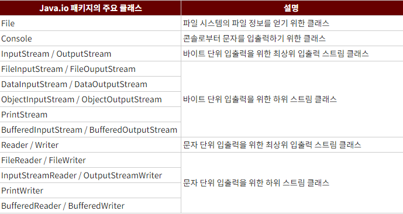
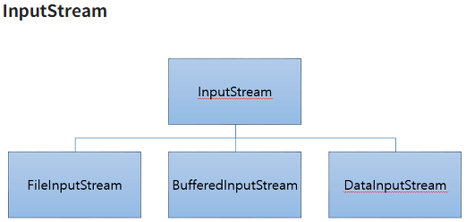
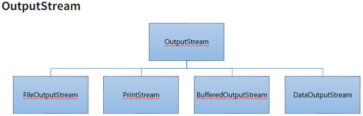

# java.io 패키지 정리

## 주요 클래스
- 자바의 기본적인 데이터 입출력은 Java.io 패키지에서 제공한다.
- Java.io 패키지에서는 파일 시스템의 정보를 얻기 위한 File 클래스와 데이터를 입출력하기 위한 다양한 입출력 스트림 클래스를 제공합니다.

- 바이트 단위 입출력 스트림 : 그림, 멀티미디어, 문자 등 모든 종류의 데이터들을 주고 받을 수 있다.
- 문자 단위 입출력 스트림 : 오로지 문자만 주고받을 수 있게 특화

Java.IO 클래스</img>

## InputStream

InputStream은 바이트 기반 입력 스트림의 최상위 클래스이며 추상클래스이다.
모든 바이트 기반 입력스트림은 InputStream을 상속받아서 만들어 진다.

InputStream의 메서드 
|메서드|설명|
|:---|----|
|`read()`|입력 스트림으로부터 1바이트를 읽고 읽은 바이트를 리턴|
|`read(byte[] b)`|입력 스트림으로부터 읽은 바이트들을 매개값으로 주어진 바이트 배열 b 에 저장하고 실제로 읽은 바이트 수를 리턴|
|`read(byte[] b, int off, int len)`|입력 스트림으로부터 len개의 바이트만큼 읽고 매개값으로 주어진 바이트 배열 `b[off]`부터 len개까지 저장합니다. 그리고 실제로 읽은 바이트 수인 len개를 리턴합니다. 만약 len개를 모두 읽지 못하면 실제로 읽은 바이트 수를 리턴합니다|
|`close()`|사용한 시스템 자원을 반납하고 입력스트림을 닫습니다|

</img>

## OutputStream

OutputStream은 바이트 기반 출력 스트림의 최상위 클래스로 추상클래스입니다. 모든 바이트 기반 출력 스트림 클래스는 이 클래스를 상속받아서 만들어집니다. OutputStream 클래스에는 모든 바이트 기반 출력 스트림이 기본적으로 가져야 할 메소드가 정의되어 있습니다.

|메서드|설명|
|:---|----|
|`write(int b)`|출력 스트림으로부터 1바이트를 보냅니다 (b의 끝 1바이트)|
|`write(byte[] b)`|출력 스트림으로부터 주어진 바이트 배열 b의 모든 바이트를 보냅니다|
|`write(byte[] b, int off,int len)`|출력 스트림으로부터 주어진 바이트 배열 b[off]부터 len개까지의 바이트를 보냅니다.|
|`flush()`|버퍼에 잔류하는 모든 바이트를 출력합니다.|
|`close()`|사용한 시스템 자원을 반납하고 출력 스트림을 닫습니다.|

</img>