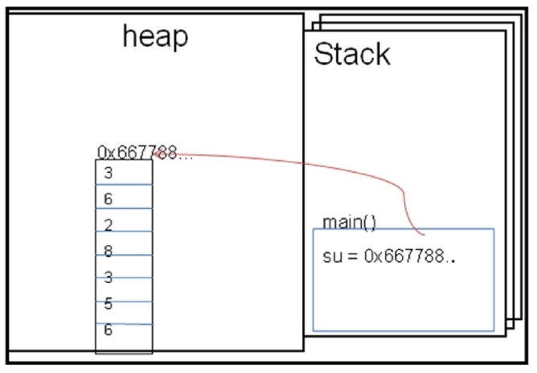

# JAVA Chapter 1 Summary

## Java의 메모리 사용
### Java의 배열

- 자바의 배열은 객체이다

```java
    int[] arr;      // int와는 다른데이터 타입. int형 배열 데이터를 선언
    int[] arr = new int[3];     // int형 데이터 3개를 남는 int형 배열을 선언
```

#### 배열 (Array)
- 정의 : 같은 데이터 타입의 순서적 나열
- 특징 : 선언과 동시에 크기가 결정되어지며, 한번 결정된 크기는 변경할 수 없다
- 자료구조중 가장 빠른 검색이 가능하다
- 배열은 생성하면 타입에 따라 기본값으로 초기화 된다
    ||정수|실수|문자|논리|참조|
    |:-----:|:-----:|:-----:|:-----:|:-----:|:-----:|
    |**기본값**|0|0.0|\u0000|false|null|
- 선언과 초기화를 동시에 할 수 있다
```java
int[] arr = {1,2,3}; // 배열 변수 arr 선언과 동시에 3개의 데이터로 초기화
```
- 반복문을 이용하여 편하게 사용이 가능하다
```java
    for(int i = 0; i<arr.length; i++)
        System.out.println(arr[i]);
```

### Java의 데이터 형태
1. Primative Data
    - call by value 형태로 변수를 가져온다.
1. User Defined Data (reference type)
    - 배열 / 클래스 / 인터페이스 가 있다.
    - 보통 ```new``` 키워드를 통해 정의된다.
    - 크기가 정해져 있지 않다.
    - call by refence (주소) 를 통해 호출을 한다.
    - a.k.a reference data type

### Java의 메소드(함수) 호출
- 함수
    > 선언부, 구현부, 호출부로 구성된다.


1. Java는 함수의 호출시 stack구조에 frame을 생성한다.
1. 생성된 frame을 stack의 top에서부터 실행한다
1. 위 과정을 반복하며, main함수가 적재된 프레임이 끝나, stack이 비게 되면 프로그램을 종료한다
- 지역변수는 Frame안에 생성되며 Frame이 소멸하면 같이 소멸한다


- Heap 영역
    - 동적할당 되는 데이터를 저장한다. (```new``` 키워드를 통해 생성되는 데이터)
    - heap 영역은 자유롭게 늘어날 수 있다.<br><br>
<br>heap & stack structure in java</img>

## Java Shortcut Rule
- 비트 연산자와 논리연사자의 차이에서 발생하는 현상이다

```java
    if((a>b) & ((a++)>b) )
    {
        // true
    }
    // false
```
- 코드가 위와 같을 때, a>b가 참이던 거짓이던, 뒤의 ((a++)>b)를 실행한다.

```java
    if((a>b) && ((a++)>b))
    {
        // true
    }
    // false
```
- 위 코드에서, 앞의 조건 (a>b)가 **참일 때 만** 뒤의 조건 ((a++)>b)가 **실행**되어 a값이 1 증가한다.
하지만, 앞의 조건이 거짓이면 뒤의 조건은 실행되지 않는다

컴퓨터는 기본적으로 메모리 페이징시 4바이트를 사용하므로 프로그래밍 시 어떤 값이든 4바이트를 기준으로 생성된다

```java
class Member{}  // 클래스 선언

Member m = new Member();    // 클래스 객체 생성


Member[] marr = new Member[3];  // marr 은 주소값을 갖게 되므로, 4Bytes 공간을 갖는다
marr[0] = m;    // marr[0]에는 m의 주소가 들어가게 된다
marr[1] = new Member();
```


#### GC (Garbage Collector)
- heap 영역의 데이터들을 삭제해준다
- 레퍼런스 값들을 이용하여 삭제를 한다

### 얕은복사 / 깊은 복사
- 얕은 복사 : 주소값만을 복사해온다.
```java
    int[] arr = {1,2,5,7};
    int[] arr2 = new int[arr.length+1];
    arr2 = arr; // 얕은 복사, arr2와 arr의 주소값이 같아진다
```
- 깊은 복사 : 주소가 아닌 데이터를 복사한다.
    - 깊은 복사를 하려면?
        - 값 복사 (value copy) or ```System.arraycopy()```를 사용한다
```java
    arr2[3] = arr[3];   // value copy(값 복사)

    System.arraycopy(src, srcPos, dest, destPos, length);
```


#### Java 1.5 이후
- for~each 기능 제공
```java
    // for문은 arr이 가지고 있는 길이만큼 반복하며, 인덱스가 아닌 값을 가져온다
    for(int val : arr){
        System.out.println(val);
    }
```
- Generic 제공
다양한 타입의 객체들을 다루는 메서드나 컬렉션 클래스에 컴파일 시의 **타입 체크**를 해주는 기능이다