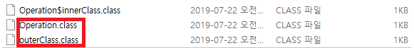
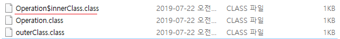
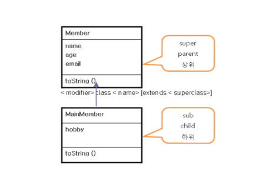

# JAVA Summary Week 2

## 1. 객체 지향이란?
SW의 모든 구성원이 객체(Object)로 구성되며, 객체들의 관계성으로 프로그램이 작동되는 것이다. 그렇기 때문에 객체를 만들기 위해 클래스를 만들기 위해 클래스를 이용하여 객체가 가져야할 구성요소를 설계하게 된다.

### 1-1. OOP (Obejct Orientation Programming)
|요소|Design|Object|
|:---|:---:|:---:|
|Abstraction (추상화)|class (Blueprint of the object)|object|
|Encapsulation (캡슐화)|
|Inheritance (상속)|
|Polymorphism (다형성)|

> 클래스는 시간이 지나도 변하지 않지만, 객체는 시간이 지나면 변할 수 있다.

## 2. class 구성과 object의 사용법
- 클래스의 구조
```java
[modifiers] class class_identifier;

[modifier] class_identifier(...){...}

[modifiers] return_type method_identifier ([arguments]){
            method_code_block
            ...
    }
```

```java
public class Member{    // 클래스 선언부
    String name;    // 데이터를 저장하기 위해 변수선언
    int age;
    String email;

    public void memberInfo(){   // 필요한 기능 정의
        String info = name + "\t|"+age+"\t|"+email;
        System.out.println(info);
    }
}
```
---

1. 객체 변수 선언
```java
ClassName ver;
```

2. 객체의 생성
```java
ver = new ClassName();
```

3. 객체의 사용
- 객체에는 멤버변수만 있다.
```java
ver.variable = value;
ver.method();
```

객체 변수의 선언과 객체 생성을 동시에
```java
ClassName ver = new ClassName();
```

**자바에서 package와 import외에 메소드 클래스 밖에 작성되는 것은 없다**

<br>

**하나의 ```.java```파일에는 하나의 public class 만 작성 가능하며, public 접근지정자는 자바파일의 파일명과 같아야 한다**

```java
// 클래스와 .java 파일명의 관계
// ExName.java 이어야 컴파일이 됨
public class ExName{

}

class Hello{

}
```
- 자바 파일명이 ExName.java가 아니면 컴파일이 되지 않으며, 컴파일이 완료되면 각 클래스 이름의 .class파일이 생성된다.
<p></p>

```java
// 클래스와 이너클래스 예
// 이너클래스 작성시
public class ExName{
    class Hello{}
}
```
- 위 예제를 컴파일 하면 ExName.class와 ExName$Hello.class 파일이 생성된다.

<p></p>
---
#### 자바의 import
- 컴파일이 완료되면 import 구문은 없어진다.
- ```java.util.*``` 패키지의 ArrayList사용시, 컴파일이 완료되면 ArrayList는 java.util.ArrayList로 변하게 된다
---

**static 키워드가 붙는 메소드에서는 일반 메소드를 호출 할 수 없다.**
---
### 생성자 (Constructor)
생성자는 객체 생성시 자동 호출되는 특별한 기능으로 주로 객체 초기화 작업을 수행.
클래스와 이름이 같으며, 리턴타입이 반드시 없어야 함

사용자 정의 생성자가 없을 경우, JVM이 자동적으로 기본 생성자 ( 인자와 바디가 없는 메소드 )를 생성하나, 사용자가 선언한 생성자가 있을 경우 default constructor는 자동으로 생성되지 않는다.
만약 다른 생성자가 있을 때, default constructor가 필요할 경우 메소드 오버로딩을 통해 생성을 한다

|오버로딩|오버라이딩|
|:---|:---|
|같은 이름의 함수 여러개를 정의하고, "**매개변수의 유형**" 또는 "**개수**"를 다르게 하여 다양한 유형의 호출에 응답하게 한다|- 상속 관계에 있는 클래스 간에 같은 이름의 메소드를 정의하는 것
|함수의 인자 개수가 다르거나, 리턴 타입이 다른 경우| - 부모가 가지고 있는 함수를 ```재정의``` 해서 사용하는 것, 리턴타입 메소드이름 인자는 같으나, 함수 바디가 달라 리턴값이 달라지는 경우|

### ```this``` 키워드
객체의 주소값을 가진다.<br>
객체 생성시 자동으로 만들어지며, 함수 내부에서만 사용이 가능하다.<br>
함수 안에서만 쓸 수 있다.<br>

```this```를 이용한 생성자 생성도 가능하다
```java
class Person{
    Person(){}
    Person(int age){
        this(); // 위의 Person(){} 생성자를 호출하는 것임
    }
}
```
객체 생성시 그 객체의 레퍼런스를 저장하기 위한 this 레퍼런스가 자동 생성된다. 메서드(생성자) 수행 시에 현재 수행중인 객체의 레퍼런스 정보를 가지고 있는 this를 상용할 수 있다.


### Method

클래스내에 객체가 가져야 할 기능 정의시에 메서드를 사용한다.
```java
modifier return_type method_name (parameter list){
    // 수행할 문장들
}
```

- method는 객체가 가져야 할 기능을 구현한다.
- 기능 수행 시 필요한 정보(Data)를 parameter list를 이용하여 입력받는다.
- 기능 처리 후 결과값을 필요에 따라 method를 호출한 측에 return을 이용하여 결과값을 전달한다.
- 전달할 결과값이 없을 경우 (return 되는 값이 없을 경우) return_type을 void라 명시한다.
- Overloading 기법을 이용하여 같은 이름의 method를 정의할 수 있다.

##### 멤버변수 지역변수

멤버변수 : 객체 생성시 자동으로 초기화<br>
지역변수 : 자동으로 초기화 되지 않으므로, 초기화를 해주어야 함<br>

### Encapsulation (캡슐화; 은닉화)

#### Access Modifier
클래스 정의 시 접근 단계를 정의하기 위하여 Access Modifier(접근 제한자)를 이용한다. 접근 제한자는 다음과 같이 4단계가 있다.<br>

> 데이터의 무결성을 지키기 위한 방법

|Access Modifier|Same class|Same package|Subclass|universe|
|:---:|:---:|:---:|:---:|:---:|
|private|Yes|||
|(default)|Yes|Yes|||
|protected|Yes|Yes|Yes||
|public|Yes|Yes|Yes|Yes|

- private : 같은 클래스 내에서만 사용할 수 있다.
- (default) : 아무것도 정의하지 않았을 경우, 같은 클래스, 같은 패키지 내에서만 사용할 수 있다.
- protected : 패키지가 다르면 사용할 수 없으나, 상속을 받았다면 사용할 수 있다.
- public : 어디서나 사용할 수 있다.

기본적으로 접근지정자는 public이 붙는다

> 기능에는 public, Data에는 private을 기본적으로 붙이는게 좋다

> Java에서는 Access Modifier를 이용하여 **Encapsulation**을 구현한다.

## API (Application Programming Interface)
객체지향에서 class 단위로 미리 구현되어 제공되는 프로그램을 API라 한다. class 단위의 library이다.

- API의 종류
    - 표준 API : Java와 함께 구현되어 제공되는 프로그램
    - 벤더 API : 기업에서 (프로젝트에 사용 하기 위해) 미리 작성해 놓은 프로그램
    - 사용자 정의 API : 개발자가 미리 작성하여 사용하는 프로그램

- 표준 API
    - class file : jdk 설치 폴더 `\jre\lib\rt.jar` 로 java 실행 시에 사용한다.

- 표준 API의 package 구조
    - java.awt : 자바의 기본 그래픽 화면 클래스를 제공한다.
    - java.io : 자바의 입출력 관련 클래스와 인터페이스를 제공
    - java.lang : 자바의 기본적인 클래스를 제공한다.
    - java.net : 네트워크 관련 클래스
    - java.sql : 자바가 DB를 연동하기 위한 관련 클래스와 인터페이스를 제공
    - java.text : 문자열 포맷 관련 클래스 제공
    - java.util : 자료관리에 필요한 클래스 및 기타 클래스
    - javax.sql : 자바가 DB 연동하기 위해 확장된 클래스들
    - javax.swing : 자바의 확장된 그래픽 관련 클래스

- package<br>
Java에서는 작성된 많은 class들을 분리하여 관리하기 위해 package를 사용한다. 파일관리의 폴더와 유사하다.
반드시 class 파일 내에 자신 첫 라인에 package를 명시하고 있어야 하며, 한번만 정의해서 사용할 수 있다.


## 상속 & 다형성 (Inheriance & Polymorphism)

### 1. Inheritance
class 설계 시 특정 class를 상속받아 그 class의 Data(변수)와 기능(method)를 사용할 수 있도록 한다.

- Generalization
    - 추출된 class의 공통적인 특성을 모아 super class로 정의할 수 있다.
- Specialization
    - 비슷한 속성과 기능을 가지고 있는 다른 class를 상속 받아 새로운 class를 정의할 수 있다.

상속되는 클래스의 속성이나 기능을 선택적으로

JavaDoc 주석처리
```java
/** product Number */
int productNum;
```

Encapsulation<br>
setter/getter를 사용하는 이유 -> 속도는 늦더라도 정확한 데이터가 들어오게 하려는 목적

toString() method : java.lang.object 클래스에 정의되어 있다.


---

## 상속 (Inheritance)
> subclass가 superclass의 **모든것**을 물려받는 것
>> 선택적으로 상속이 되지 않음, 무조건 모든것을 받아야한다 --> sub는 곧 super가 된다 ( sub is a super )

class 설계 시 특정 class를 상속받아 그 class의 Data(변수)와 기능 (method)를 사용할 수 있도록 한다.
- Generalization
    - 추출된 class의 공통적인 특성을 모아 super class로 정의할 수 있다.
- Specialization
    - 비슷한 속성과 기능을 가지고 있는 다른 class를 상속 받아 새로운 class를 정의할 수 있다.

```java
class subClass extends superClass{
    // statemnet
}
```

#### 상속을 받는 이유
1. 추가 - 기능의 추가
1. 재정의 - 기능의 재정의
1. 형변환 - 레퍼런스 데이터 타입의 형변환 때문에

UML에서의 상속
<br><br>inheritance in UML </img><br>

다중상속(Multi Inheritance)의 단점 : 모호성이 발생할 수 있다.


##### 접근지정자에 따른 상속관계

상속받을 경우 부모 클래스 멤버를 `this`키워드를 이용하여 사용할 수 있다.
`super`를 사용할 경우 부모 클래스의 멤버만 접근 가능하다.

private : 상속은 되지만 접근은 할 수 없다.

|keyword|this|super|
|:---:|:---:|:---:|
|가리키는 대상|자기 자신 클래스를 가리킨다|상속받는 클래스를 가리킨다|
|생성자 호출| this(); | super(); |
||자기 자신 객체의 reference를 가지고 있다.|상위객체의 reference를 가지고 있다.|


```java
public class Father{
    String name;
    public Father(String name){
        this.name = name;
    }
}

public class Son extends Father{
    // 아무것도 하지 않았는데 에러가 발생!
    // Son의 기본생성자는 파라미터가 없는 생성자이다.
    // Father 클래스를 상속받았으므로, Son 클래스가 알맞게 진행되려면 Father의 객체가 생성이 되어야 한다.
    // Father의 객체가 생성이 된다 --> Father클래스의 생성자가 불린다.
    // 그러나 현재 코드에서 Father의 기본생성자인 Father(){}는 선언되어있지 않다
    // 그러므로, super();를 자동으로 호출하지 못하고, 에러가 발생하게 된다
}
```

이를 알맞게 수정하면

```java
public class Father{
    String name;
    public Father(String name){
        this.name = name;
    }
}

public class Son extends Father{
    Son(String name){
        super(name);    //  super클래스에 생성된 생성자를 호출하는 생성자를 만들어준다
    }
}
```
또는

```java
public class Father{
    String name;
    public Father(String name){
        this.name = name;
    }

    public Father(){}   // super클래스의 기본생성자를 작성
}

public class Son extends Father{
    Son(String name){
        super(name);
    }
}
```

상속 받은 메소드/변수의 Access Modifier는 원래의 Access Modifier보다 같거나 넓은 범위만 사용이 가능하다

Private 접근 지정자의 경우,

## Method Override (메소드 오버라이드)

> 일단 상속을 받아야 재정의가 성립한다

메소드는 구현부 / 호출부 / 선언부 로 나누어 지는데, **메소드 오버라이딩**은 이 중, 구현부를 ***재정의*** 하는 것이다.

> 이름, 리턴값, 파라미터는 모두 같으나 함수의 body(구현부)가 달라지게 된다.

