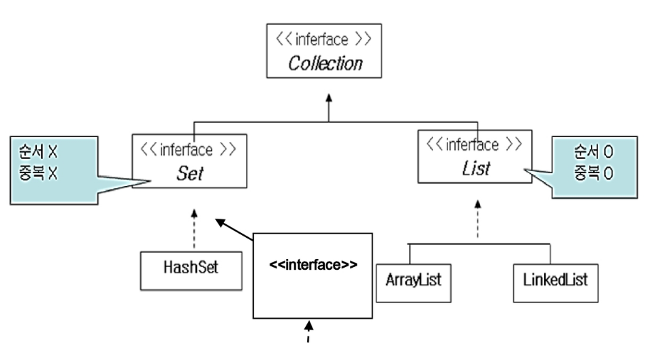
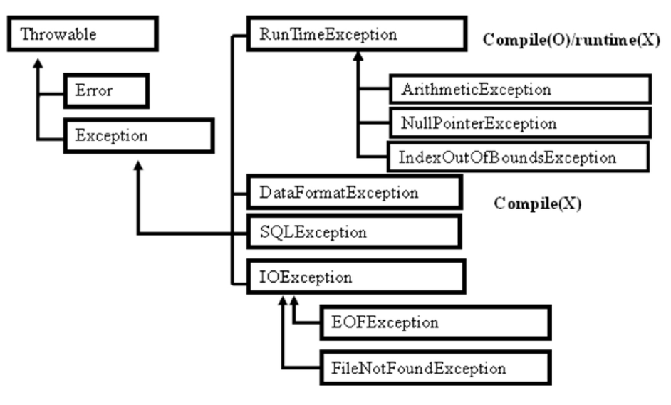

# Java Summary Week 3

## java.lang API
- java.lang : java언어의 가장 기본적인 클래스들을 모아놓은 패키지이다.
- java.lang의 패키지들은 import하지 않아도 자동으로 import 해준다

- Object
    - java.lang.Object 클래스는 `최상위 클래스` : 모든 클래스에서 Object클래스를 자동으로 상속받는다.
    - 모든 클래스가 기본적으로 상속받아야 하기 때문에 **특별히 extends Object를 사용하지 않아도** 컴파일러에 의해 상속된다.
    - Object 클래스에는 모든 클래스의 공통적인 기능을 정의하고, 자주 사용되는 Method를 정의하여 필요 시 Overriding 해서 사용하도록 권장한다.

- 필요 시에 자주 Override 되는 메서드
    - toString():String - 객체를 대표하는 문자열을 return 하도록 구현한다.
    - hashCode():int - 객체를 구분하는 코드 값을 리턴하도록 구현한다.
    - equals(Object o):boolean - 객체의 내용을 비교 할 수 있도록 구현한다.

- String
    - 문자열을 간단히 저장할 수 있는 클래스로 `+` 연산이 가능하다
    - 유일하게 new를 사용하지 않고도 객체 생성이 가능
    - 어떤 type이든 String 객체에 +를 하게 되면 문자열로 변환되어 결과값이 모두 String으로 변환
    - String 값은 어떤 값으로든 벼녕되고, + 연산도 되어지지만 메모리 내부에서 String 객체의 값이 변경되지 않고, StringBuilder를 이용하여 변경처리하고, String으로 변환하여 출력한다.
    - 위 항목의 이유로 인해, 성능저하가 생길 수 있어서, 문자열 편집이 많이 필요한 경우는 StringBuilder를 생성하여 문자열을 편집하는 것이 좋다.

|Member|retur type|sbsc|etc.|
|:---|:---:|:---:|:---:|
|concat(String s)|String|s와 연결된 문자열을 리턴|'+'와 같다|
|repalce(char old, char new)|String|문자열에 있는 특정 문자(old)를 다른 문자(new)로 치환||
|substring(int start, int num)|String|문자열 중 일부를 추출|추출한 문자열을 리턴한다|
|charAt(int index)|char|특정위치(index)의 문자||
|length()|int|문자열의 길이를 리턴||
|toLowerCase()||모든 문자를 소문자로 변경|
|toUpperCase()||모든 문자를 대문자로 변경|
|trim()||문자열의 앞뒤 여백을 제거|문자열 중간의 공백을 제거하지는 않는다. 중간 공백을 제거하려면 repalceAll을 사용하는것이 좋다|
|endsWith(String s)||특정문자열로 끝나는지 여부를 리턴||
|startsWith(String s)||특정문자열로 시작하는지의 여부를 리턴||
|indexOf(String s)||특정문자가 처음 나타나는 위치|
|indexOf(char a)|||
|indexOf(String s, int offset)|||
|equals(String a)||문자열 비교||||
|equalsIgnoreCase(String s)||대소문자 구별 없이 비교||
|compareTo(String s)||알파벳의 순서 비교||
|insert(int offset, String s)||offset에 s를 삽입||
|reverse()||문자열 순서를 뒤집는다||
|setCharAt(int index, char ch)||index의 문자를 ch로 변경||
|setLength(int newLength)||문자열 길이를 새로 설정||

#### StringBuilder
문자열을 편집하여 사용하고자 할 경우에 사용하는 클래스이다

```java
StringBuilder str = new StringBuilder(initial value);
str.append("aaa");  // 문자열을 뒤에 추가
System.out.println(str);    // StringBuilder 출력

str.insert(int index, String newString);    // index에 newString 삽입
```


### Usage modifer
#### static
//TODO : summary about the static keyword

- 멤버변수(member variables)
- 멤버 메소드 (member method) : static method는 객체 생성 없이 사용되므로, 메서드 안에서 static 변수만 사용할 수 있다.
- 멤

---
#### final<br>
    마지막을 의미하며, 클래스 앞에 정의하여 `더이상 상속 받을수 없음`을 메소드 앞에 정의하여 `Overriding 할 수 없음`을, 변수 앞에 정의하여 `값 변경할 수 없음`을 즉, 상수임을 의미한다.

    - class : 상속 받을 수 없음
    - method : Override 할 수 없음
    - variable : 상수로 정의

|위치|비고|
|:---:|:---:|
|class|상속 받을 수 없음
|method|Overriding 할 수 없음(메소드가 변형 될 수 업음)|
|variable(변수)|값을 변경할 수 없음(상수화; const in c), 상수는 선언과 동시에 초기화가 필요하다(초기화 하지 않으면 에러)|
---

#### abstract
일부 `구현되지 않은 메서드를 포함할 수 있는 클래스 정의`시 사용, `구현되지 않은 메서드 정의시에 사용`한다<br>
- abstract class 는 완전히 구현되지 않았기 때문에 객체를 생성하지 못한다.
- 상속을 통해 `상속 받은 클래스가 abstract 메서드를 모두 구현해야` 객체 생성이 가능하다.

```java
// 추상 메소드가 존재하는 클래스는 abstract키워드를 통해 추상클래스로 만들어주어야 한다.
// 추상 메소드는 추상메소드 뿐만 아니라 일반 메소드도 갖고 있을 수 있다.
public abstract class AbstracTest{
    public void play(){}
    public abstract void show();    // 구현부가 없는 메소드, 구현부가 없는 메소드는 abstract 키워드를 이용하여 추상 메소드를 만들어야함
    // 추상 메소드 : body가 없는 메소드
}
```
-  abstract클래스를 상속 받을 때는, `추상클래스의 메소드를 오버라이딩` 하거나, 똑같이 `서브클래스도 abstract키워드를 이용해 추상클래스로 변경`해주어야 한다.
추상 메소드가 필요한 이유

- abstract 클래스가 abstract클래스를 상속받을 수 있다.
- abstract 키워드를 통해 클래스를 선언하면, `abstract 메소드가 없어도 객체화 시 에러`가 발생한다
- 추상클래스의 일반 메소드(추상 메소드가 아닌)를 자식클래스에서 오버라이딩 하지 않아도 에러가 발생하지 않는다. 하지만, 객체에서 이를 호출하면, 추상 클래스의 메소드가 호출이 된다.

##### 추상클래스를 사용하는 이유
객체화는 못하지만 `상위타입으로 사용`한다.(generalization)
구현이 필요한 `메소드드의 구현을 강제`한다.<br>
공통된 필드와 메서드를 통일할 목적

---

#### Interface(인터페이스)
쉽게 말해 껍데기, 설계도 또는 명세<br>

모든 메소드가 추상 메소드이고, `일반 변수를 가질 수 없다`.
즉, interface를 구현(implements)한 클래스는 `모든 메소드를 강제적으로 구현`해야 한다.

`interface` 키워드를 사용한다

- 상수(final)와 추상메소드 만으로 구현한다
- 모든 메소드가 `추상 메소드`여야만 한다
- super type으로 사용이 가능하다
- 상속한 subclass들의 명세서 역할로 사용
- 변수를 갖지 못하고, `상수`만 가질 수 있다. ( 변수는 모두 `final` 키워드를 붙여야 함; 자동으로 컴파일러가 final을 붙인다)
- access modifier는 `public`만 가능함, 안쓰면 자동으로 작성되며, private, protected를 쓰면 에러가 발생
- 모든 메소드가 추상메소드 이므로, `abstract` 키워드를 작성하지 않아도, 자동으로 `abstract` 키워드가 붙는다.
- `new`키워드를 통한 객체화가 불가능하다

> interface를 implements를 해도 상속(extends)를 받을 수 있다. 이렇게 여러개를 상속받을 수 있는것이 인터페이스의 가장 큰 장점이다

클래스 상속만으로 기능을 한번에 불러오기 힘들때 인터페이스를 같이 사용하면 좋다

---

#### 추상클래스(abstarct class)와 인터페이스(interface)
|\\|추상클래스|인터페이스|
|:---:|:---:|:---:|
|일반 변수|가능|불가능 (상수만 가능)|
|일반 메소드|가능|불가능|
|추상 메소드|0개 이상의 추상메소드 필요|필수|
|상속을 위한 키워드|extends|implements|
|상속 받을 때|상속받은 경우 추상메소드만 구현|상속받은경우 모든 메소드 구현(모든 메소드가 추상클래스)|
|인스턴스화|불가능|불가능|
|상속|다중상속 불가|다중상속 가능|
|객체화|불가능|불가능|
|자식클래스에서 업캐스팅|가능|가능|

---

#### Math
수학과 관련된 기본적인 함수들을 구현한 클래스
- 수학과 관련된 함수(메서드)를 제공
- final class ( final이 선언되어 있다. )
    - 클래스에 final 키워드를 선언해, 상속을 하지 못하게한다.
    - 클래스 상속을 막는 또하나의 방법은 모든 메서드와 변수를 private으로 선언하는 것이다.
- static 메서드를 제공<br>
    variation on max, min, abs<br>
    tringonometry : sin, cos, tan, asin, acos<br>
    trucation : cell, floor, round<br>
```java
inf i = Math.round(3.4f)    // 첫째자리에서 반올림
```


#### Wrapper class
Java의 기본형 데이터 타입을 객체화 시키는 클래스들이다.
> 데이터를 객체화 하기 위해 쓰는 클래스다. wrapper클래스는 primitive 데이터를 객체로 포장해준다.

- Java는 객체지향 언어이다.
- 객체가 아닌 것 : primitive data type(계산을 위한 type)
    - byte, short, int, long, foat, double, char, boolean
    - primitive type을 객체화 시켜주는 클래스
- primitive 객체화
    - Integer iobject = new Integer(300);

|기본 타입 (primitive type)|래퍼 클래스 (wrapper class)|
|:---:|:---:|
|byte|Byte|
|short|Short|
|int|Integer|
long|Long|
|float|Float|
|double|Double|
|char|Charater|
|boolean|Boolean|

Boxing(박싱) : primitive type -> wrapper class
UnBoxing(언박싱) : wrapper class -> primivite type
> 박싱/언박싱을 통해 primitive -> object / object->primitive의 변환이 편하게 바뀌었다.


## Collection API
Collection API는 객체들을 저장, 검색, 삭제하는 기능 등을 제공하는 클래스들의 집합

- java.util.package에 정의되어 있다.
- SET 계열, LIST 계열로 나뉜다.
    - SET 계열 : 순서 X, 중복 X
    - LIST 계열 : 순서 O, 중복 O



Collection 클래스의 특징
- add 메소드 존재 : Object 타입을 인자로 받는다.

#### Set
Set에 객체타입의 데이터를 넣을 때 `Comparable` 메소드를 구현해주어야 한다.<br>
set은 데이터의 중복을 허용하지 않으므로 비교할 무언가가 필요한데, primitive타입이 아닌 reference 타입의 데이터는 `단순비교가 어렵다`.<br>
그렇기 때문에, Set클래스는 `Comparable`을 이용하여 reference Type 데이터를 비교하고 set 객체에 넣으지 말지 결정하게 된다


#### Map
데이터 저장, 관리 시에 `검색을 보다 쉽게`하기 위해 구현된 클래스이다.
- 객체를 `key`와 `value`로 구분하여 관리한다.
- key를 통한 검색과 삭제를 쉽게 한다.
- Collection 계열이 아니다.

|멤버|기능|
|:--:|:--|
|put(key, value)|자료구조에 데이터 삽입|
|get(key)|key에 맞는 데이터를 가져온다|
|keySet()|key 모음을 가져온다|
<br>

---

## Generic (제너릭)
클래스 선언(변수화) 시에 타입을 결정하게 만든다.<br>
`Primitive` 타입 뿐 아니라 `UserDefined Type`(사용자 정의 타입; class 등) 또한 지정이 가능하다.<br>
클래스 내에서 사용할 사용자 임의 타입을 만든다.

> `Generic`의 타입으로 기본형을 쓸 때, `Wrapper Class`를 사용해야 한다.

```java
// Generic class 안에서 I라는 타입을 씀
// I의 타입은 정해지지 않았다.
class Generic <I>{  // generic 클래스 선언부 I라는 타입을 선언
}
----------------------------------------------
class GenericMain{
    public static void main(String[] args) {
        Generic<String> g = new Generic();  // Type을 String으로 쓰겠다.
        Generic<Integer> g= new Generic();  // Type을 Integer로 쓰겠다.
        // 꺽쇠괄호 안의 Generic 타입은 wrapper 클래스를 사용해야 한다.
    }
}
```


```java
class Generic <I>{  // generic 클래스 선언부
}
class Sub extends Generic{
    // 그냥 오버라이딩 할 경우 Object 타입으로 만들어진다
}

----------------------------------------------
class Generic <I>{  // generic 클래스 선언부
}
class Sub extends Generic <String>{
    // Generic의 I 타입을 String으로 받는다
    // Generic의 메소드를 오버라이드시 String타입이 된다
}
```

### Comparable 인터페이스
primitive 타입이 아닌 타입의 정렬을 위해 사용된다 ( 특히 클래스 )

인터페이스이므로 구현을 해야하고, 제너릭으로 구현되어 있기 때문에 타입을 지정해주어야 한다.

Comparable 인터페이스를 구현하였으므로, Comaprable의 추상 메소드인 `cmopareTo(T t);` 메소드를 구현해주어야 한다.

---

## 클래스를 객체를 정렬하는 방법
#### compareTo(T t)
compareTo의 리턴값은 `1, 0` 또는 `-1` 이다.

```java
class Car implements Comparable<Car>{
    // Comparable은 Car 타입을 비교한다
    // CompareTo에서 비교 로직 구현 필요
    // 반환값은 밑의 표와 같다.
    @Override
    public int compareTo(Car o){
        if(파라미터1 < 파라미터2){
            return 1;
        }
        return -1;
    }
}
```

|리턴 하는 값|결과|
|:--:|:--|
|음수 (-1)| 첫번째 파라미터 < 두번째 파라미터 |
|0| 첫번째 파라미터 == 두번째 파라미터 |
|양수 (1)| 첫번째 파라미터 > 두번째 파라미터 |


#### comparator<T>
```java
// 익명클래스를 이용한 Comparator
Comparator<Car> com = new Comparator<Car>(){
    @Override
    public int compare(Car o1, Car o2){
        return o1.price - o2price;
    }
};

Arrays.sort(cars, com); // 위의 compartor를 이용한 정렬
```

|리턴 하는 값|결과|
|:--:|:--|
|음수 (-1)| 첫번째 파라미터 < 두번째 파라미터 |
|0| 첫번째 파라미터 == 두번째 파라미터 |
|양수 (1)| 첫번째 파라미터 > 두번째 파라미터 |

---


## java.util
### Caleandar
시간을 기억하는 class이다.
싱글톤 패턴이 적용되어 있다.
- System.currentTimeMills(): long - 현재 시간을 1/1000 초로 long 타입으로 리턴한다.
- 월의 시작은 0이다.
- `MONTH`, `HOUR`, `MINUTE`, `SECOND`, `YEAR`, `DATE`는 상수로 지정되어 있어 `클래스이름.변수`로 호출 할 수 있다.


---
---

## Exception과 IO
오류 : 에러와 예외로 나뉨

에러 : 무조건적인 수정의 대상
- 컴파일 에러 : 컴파일 시 발생하는 에러
- 런타임 에러 : 실행시 발생하는 에러
<br>
* Error class (java.lang에 존재)
    - Fatal situation (serious error)
    - Unchecked exceptions (RuntimeException을 제외한 모든 Exception)
    - Not excepted to attempt recovery
    - 치명적 오류로 SW적으로 복구 불가능
    - Compiler가 체크하지 않는다.

예외 : 항상 발생하지 않음(특정상황에서 발생), 프로그램 처리중 기대되지 않는 상황<br>

* Exception class (java.lang에 존재)
    - 정확한 프로그램
    - 예외가 발생할지 모르는 상황을 체크해 준다.(Compiler)
    - 예외가 발생하더라도 프로그램을 중단시키지 않고, 복구하여 프로그램을 지속적으로 실행 할 수 있도록 한다.
    - `file not found`, `DB connection failure` 등


|Unchecked Exception|Cheked Exception|
|:--:|:--:|
|컴파일러가 에러를 체크하지 않고, 주로 실행중 발생하는 예외|JVM에서 컴파일시 에러를 체크한다고해서 Checked Exception 이라고 함|
|Checked 예외와 달리 try-catch를 강제하지 않음, 조건문이나 유효성 검증을 통해 충분히 피할 수 있기 때문<br>ex) `if(value != null)`문으로 NullPointerException을 피하는 경우|`try-catch`를 이용한 exception handling 필요|

 <span>Exception structure</span>

## Exception handling
정확한 코드의 프로그램이 예기치 않는 에러가 발생할지도모르는 상황을 체크하여 에러로 인해 프로그램이 중단되는 것을 막는다.
Exception Handling을 하지 않으면 Compile 되지 않는다.

1. `try-catch` 블록으로 감싼다.
```java
try{
    // 예외가 발생할지도 모르는 문장
}catch(XxxException e){ // Exception class
    // 예외 발생시 복구 코드
}
```
2. 여러 가지 예외가 발생할 경우는 `catch 블록을 여러개 정의`한다.
```java
try{
    // 예외가 발생할지도 모르는 문장
}catch(XxxException e){
    // 예외 발생시 복구 코드
}catch(YyyException e){
    // 예외 발생시 복구 코드
}
```
3. 예외 발생 여부와 관계 없이 마지막으로 `꼭 수행해야할 문장`이 있다면 `finally` 블록을 구현한다.
```java
try{
    // 예외가 발생할지도 모르는 문장
}catch(XxxException e){
    // 예외 발생시 복구 코드
}finally{
    // 꼭 수행해야 할 문장
}
```
4. 마지막으로 꼭 수행해야 할 문장이 있을 경우 finally 블록을 구현한다. 그러나 catch 블록이 없기 때문에 `예외가 발생하면 프로그램은 중단`된다.
```java
try{

}finally{
    // 꼭 수행해야 할 문장
}
```
5. Declare Exception : 예외를 처리하지 않고, 호출한 메서드에게 예외처리를 넘겨버릴 수 있다. 호출한 메서드에게 처리 중 예외가 발생했음을 알리기 위해 사용된다

throws : 예외가 발생할 경우 처리를 호출한 쪽으로 넘기는 방법

```java
public void method_name() throws XxxException{
    ...
    //예외가 발생할지도 모르는 문장
    ...
}
```
호출한 메서드는 반드시 예외처리를 수행해야 한다.<br>
생성자에서 예외를 호출한 쪽으로 넘기면, 반드시 객체 생서이에 예외처리를 해주어야 한다.

```java
public class ExceptionTest2 {
    public static void main(String[] args) {
        Scanner sc = new Scanner(System.in);
        try {
            // 메소드에서 예외를 넘겨받는 코드
            int res = div(sc.nextInt(), sc.nextInt());
        } catch (ArithmeticException e) {
            e.printStackTrace();
        } catch (DataFormatException e) {
            e.printStackTrace();
        } catch (Exception e) {
            e.printStackTrace();
        }
    }

    // throws를 통해 div함수를 호출한 쪽에 에러를 넘겨준다.
    // ArithmeticException 발생 가능성 : 0으로 나눌 때
    static int div(int a, int b) throws ArithmeticException, DataFormatException {
        // throws에는 여러개 Exception class가 들어갈 수 있다.
        //
        int res = 0;
        if (b == 0) {
            // java.lang.Throwable클래스를 상속받은 자식 클래스
            throw new DataFormatException();    // Exception instance를 만들어 호출한 곳에 에러를 보낸다.
        }
        // 에러가 발생한 코드의 다음 코드는 실행되지않고 메소드가 끝이 난다.
        res = a / b;
        return res;
    }
}
```
```java
// exception 클래스 만들기
// User defined Exception ( Customize Exception class)
public class MyDataInputException extends Exception {   // Exception을 상속받아주어야 한다.
    String errMsg;

    public MyDataInputException() {
    }

    public MyDataInputException(String errMsg) {
        this.errMsg = errMsg;
    }

    public void showError() {
        System.out.println(errMsg);
    }
}
// throw new MyDataInputException(); 를 이용해 예외 처리가 가능하다
```
> Exception을 상속받는 클래스만이 `catch(){}` 안에 들어갈 수 있다.
Exception handling 처리시에 Overriding 되는 메서드라면 throws는
- Super클래스의 메서드가 throws 하고 있는것을 `그대로 throws`할 수 있다.
- Super 클래스의 메서드가 throws 하고 있는 것의 Sub Exception 클래스를 throws 할 수 있다.
- Sub 클래스의 메서드에서 필요없다면 throws을 기술하지 않아도 된다.

|throws|throw|
|:--:|:--:|
|메소드 내에서 상위블럭으로 예외를 던진다|현재 메소드에서 상위 메소드로 예외를 던진다|
|자신이 예외를 처리하지 않고, 자신을 호출한 메소드에게 책임을 전가하는 것|실제로 exception을 throw할 때 사용하는 키워드|
|전가|프로그래머의 판단에 따른 처리|
|메소드 정의시 `throws`키워드를 추가하면, 해당 메소드를 `호출하는 곳에서 예외 처리`를 해야한다|강제로 예외를 발생시키는 경우 사용<br><br>throws예약어 뒤에는 java.lang.Throwable 클래스를 상속받는 자식클래스의 객체를 지정해야 한다|