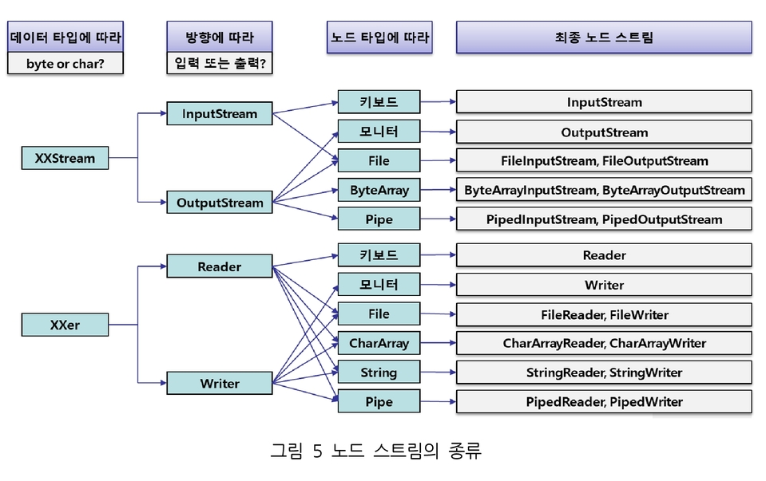
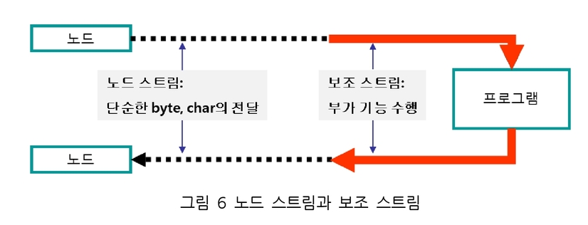
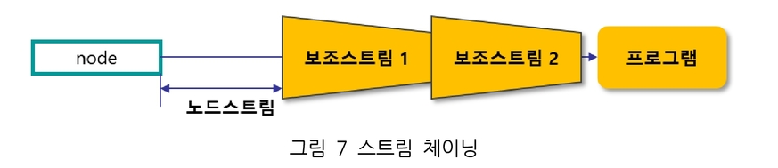

# Java Summary Week4

## 멀티 스레드(Multi Thread) 프로그래밍

1. 스레드와 프로세스
    - 프로세스 : 개별적으로 동작하는 프로그램(이클리스, 메신저 등)
    - 스레드 : 프로세스를 구성하는 작은 실행 단위 (메신저 = 채팅 + 파일 전송)
    - 멀티프로세스 : 동시에 여러 개의 프로세스를 실행하는 것
    - 멀티스레드 : 하나의 프로세스에서 여러개의 스레드가 동시에 동작하는 것

2. 멀티 스레드 프로그래밍의 장단점

## I/O
### I/O와 스트림
1. 스트림
자바의 I/O는 스트림(Stream)을 이용해서 데이터를 주고 받는 구조로 되어있다. 스트림은 수도관 같이, Source에서 Destination까지 데이터를 이동시키는 `일종의 통로`이다. 이때, 데이터의 소스나 목적지를 `노드(node)`라고 부른다.
노드의 종류에는 키보드, 모니터는 물론 파일이나 메모리, 데이터베이스, 원격지의 다른 프로그램이 될 수도 있다.
이 노드에 연결된 스트림을 노드 스트림이라고 한다.

||입력|출력|
|:--:|:--:|:--:|:--:|:--:|
|Byte 단위|InputStream(입력 스트림)|OutputStream(출력 스트림)|
|char 단위|Reader|Writer|
|사용|데이터를 받아들일 때|데이터를 내보낼 때|

> java.io 패키지에 존재

스트림의 기본 전송 단위는 `Byte`이다.<br>
문자(char)단위의 데이터를 전송하려면 InputStream 대신 `Reader`, OutPutStream 대신 `Writer`를 이용


노드 스트림의 종류


#### 키보드를 이용한 InputStream과 Reader
데이터를 읽는 InputStream과 Reader
|메서드 명|선언부와 설명
|---|---|
|read()|public abstrac read() throws IOException|
||바이트 하나를 읽어서 int로 반환. 읽을 값이 없으면 -1 리턴|
||public int read(byte b[]) throws IOEception|
||데이터를 읽어서 b를 채우고 읽은 바이트 개수를 리턴한다. 0이 리턴되면 더이상 읽을 값이 없는 상황이다|
||public int read(byte b[], int offset, int len) throws IOException|
||최대 len만큼 데이터를 읽어서 b의 offset부터 b에 저장하고 읽은 바이트 개수를 리턴한다. 따라서 len+offset은 b의 크기 이하여야 한다.
|close()|public void close() throws IOException|
||스트림을 종료해서 자원을 반납한다|

reader에서 제공되는 메서드들은 대부분 InputStream의 메서드와 유사하며, 전반적으로 byte가 char로 대체되는 형태이다

### 보조 스트림 ( 필터 스트림, 프로세스 스트림 )
노드 스트림과 달리 노드에 직접 연결되지 않고 `다른 스트림과 연결되는 스트림`<br>
보조 스트림은 노드 스트림에 부가적인 기능을 제공한다.
그래서 보조스트림을 필터 스트림(Filter Stream) 또는 프로세싱 스트림(Processing Stream)이라고도 부른다.




|기능|char 기반|byte 기반|
|:--:|:--|:--|
|byte 스트림을 char 스트림 으로 `변환`|InputStreamReader<br>OutputStreamWriter||
|버퍼링을 통한 `속도 향상`|BufferedReader<br>BufferedWriter|BufferedInputStream<br>BufferedOutputStream|
|기본 데이터 형 전송||DataInputStream<br>DataOutputStream|
|객체 전송||ObjectInputStream<br>ObjectOutputStream|
|문자열 표현으로 출력|PrintWriter|PrintStream|

- 종료할 때는 보조 스트림에서만 close()를 호출하면 노드 스트림까지 알아서 close() 처리가 완료된다.


#### 객체 직렬화
클래스를 직렬화 시키려면, Serializable 인터페이스를 구현한다.

Serializable 인터페이스는 미구현 메소드가 없다 (직렬화 가능한 쿠폰의 느낌)


```java
class Car implements Serializable{} // 클래스의 직렬화가 가능해짐
```