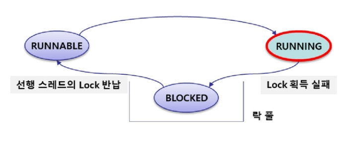
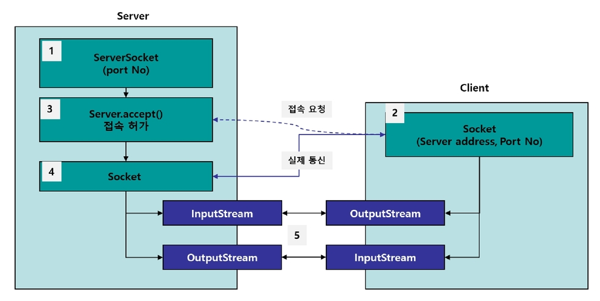
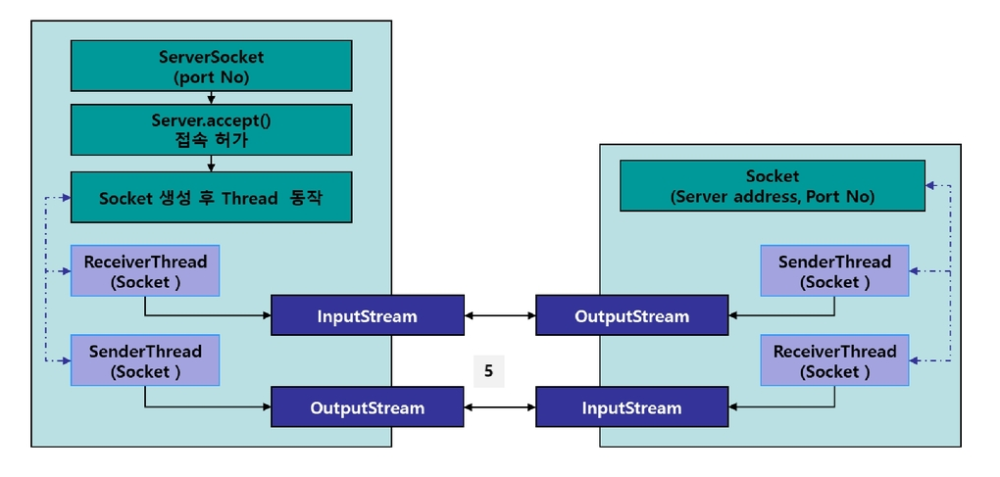
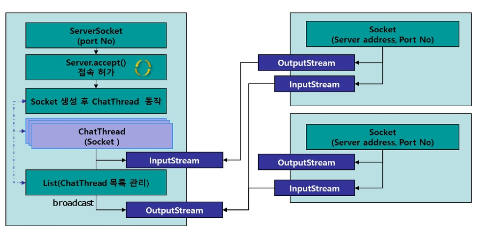

# Java Summary Week5

## 멀티 스레드(Multi Thread) 프로그래밍
### 스레드와 프로세스
- 프로세스 : 개별적으로 동작하는 프로그램( 이클립스, 메신저 등 )
- 스레드 : 프로세스를 구성하는 작은 실행 단위( 메신저 = 채팅 + 파일 전송 )
- 멀티 프로스세스 : 동시에 여러개의 프로세스를 실행하는 것
- 멀티 스레드 : 하나의 프로세스에서 여러 개의 스레드가 동시에 동작하는 것

### 멀티 스레드 프로그래밍의 장/단점
|장점|단점|
|:--|:--|
|CPU 사용률 향상|컨텍스트 스위칭 비용 발생|
|작업의 분리로 응답성 향상|스레드 제어의 어려움|
|자원의 공유를 통한 효율성 증대|
---
## 스레드 생성과 수행
1. 스레드 생성<br>
스레드는 일반적으로 `Runnable 인터페이스를 구현`하는 방법과 `Thread 클래스를 상속`받는 2가지 방법으로 만들 수 있다.

- Runnable 인터페이스의 구현<br>
    - Runnable에는 run()메서드 하나가 존재하며, 이 메서드를 오버라이딩 해서 필요한 내용을 작성한다.
```java
// Runnable 인터페이스
public interface Runnable{
    public abstract void run();
}
```
Runnable을 통해 스레드를 구현할 때는, Runnable 객체를 `Thread 생성자에 파라미터`로 넘겨줘야 한다.
```java
// Runnable객체를 Thread 생성자에 파라미터로 넘김
Thread t1 = new Thread(new Runnable(){
    public void run(){
        System.out.println("Hello");
    }
});
```

- Thread 클래스 상속
    - `Thread 클래스는 Runnable을 구현`하고 있다. 따라서 별도로 Runnable 객체를 파라미터로 넣을 필요 없이 Thread클래스만 가지고 스레드를 만들 수 있다.
```java
public class Thread implements Runnable{
    // statement
}
```
이때, Thread 클래스의 `run() 메서드를 오버라이딩`해서 필요한 비즈니스 로직을 구현해야 한다.
```java
class MyThread extends Thread{
    public void run(){
        System.out.println("Hello");
    }
}

Thread t3 = new MyThread(); // Custom Thread instance
```
Thread를 상속받는 경우 코드작성은 쉽지만, 단일 상속의 제약에 의해 더 이상 다른 클래스를 상속받을 수 없다는 단점이 발생한다. 상황에 따라 적절한 방식을 선택해야 한다.<br>


2. 스레드의 실행<br>
    스레드를 생성할 때 필요한 로직을 run() 메서드에 작성한 바 있다. 스레드를 실행 할 때 재미있는 점은 이 run()메서드를 호출하지 않는다는 점이다. `스레드를 동작 시킬 때는 Thread 클래스에 선언된 start()`라는 메서드를 사용한다.

```java
//simple multi-thread programming
public class SimpleThreadTest{
    public static void main(String[] args){
        Thread t1 = new Thread(new Runnable(){
            @Override
            public void run(){
                for(int i = 0; i<30; i++){
                    System.out.print("-");
                }
            }
        });

        Thread t2 = new Thread(){
            @Override
            public void run(){
                for(int i = 0; i<30; i++){
                    System.out.print("@");
                }
            }
        };

        t1.start();
        t2.start();
        System.out.println("main is over");
    }
}
```
스레드에서 run()메서드는 스레드에서 수행할 작업을 정의하는 메서드이고, start() 메서드 호출은 스레드의 run() 메서드가 호출될 수 있도록 준비하는 과정이다.<br>
실제 run()메서드를 호출하는 것은 JVM이다. start()가 호출되면 JVM이 운영체제의 스레드 스케줄러에 의해 가능할 때, 스레드의 run()메서드를 호출한다.

#### 멀티스레드와 메모리


3. 스레드의 상태와 제어<br>
    **1. 스레드의 상태**<br> - 스레드의 상태 값은 Thread 내부에 State라는 enum으로 정의되어 있으며, 스레드 객체의 `getState()`메서드를 이용해서 확인할 수 있다.

|enum 상수|설명|
|:--|:--|
|NEW|스레드 객체가 생성되 후 아직 start()가 호출되지 않은 상태|
|RUNNABLE|JVM 선택에 의해 실행 가능한 상태|
|BLOCKED|사용하려는 객체의 모니터 락이 풀릴 때까지 기다리는 상태|
|WAITING|sleep(), wait(), join() 등에 의해 정해진 시간 없이 대기중인 상태|
|TIMED_WAITING|sleep(), wait(), join() 등에 의해 정해진 시간 동안 대기중인 상태|
|TERMINATE|run() 메서드의 종료로 소멸된 상태|


**2. sleep()을 통한 상태 제어**<br>
sleep() 메서드는 동작하는스레드를 주어진 시간도안 일시 정지 시켜 대기 풀에서 자게 한다. 대기중인 스레드는 설정 시간이 끝나거나 interrupt()메서드가 호출되면 대기 풀에서 벗어나 다시 RUNNABLE 상태로 이동한다

|메서드 명|선언부와 설명|
|---|:--|
|sleep()|public static native void sleep(long mills) throws InterruptedException|
||mills(1/1000초) 동안 동작중인 스레드를 대기 풀에서 대기하게 한다.<br> mills가 지나면 자동으로 RUNNABLE 상태로 이동한다.|

**3. join()을 통한 상태 제어**<br>
sleep()과 유사하게 스레드를 대기 풀로 이동시키는 메서드이다.
join()은 `다른 스레드와의 선후 관계가 있을 때 사용`되는데 다른 스레드의 작업이 종료될 때까지 join()을 호출하는 스레드가 대기 풀에서 대기한다.
<br>

|메서드 명|선언부와 설명|
|----|:---|
|join()|public vinal void join() throws InterruptedException|
||스레드가 소멸될 때까지 대기한다|

**4. interrupt()를 통한 대기 풀 탈출**<br>
sleep()이나 join()으로 인해 대기 풀에서 대기중인 스레드들은 지정된 시간이 지나거나 끼워 넣었던 스레드가 종료되면 자동으로 RUNNABLE 상태로 이동한다. 그런데 대기 중인 스레드를 임의로 RUNNABLE 상태로 이동시켜야 할 경우도 있다.<br>`특정 시점에 대기중인 재생 스레드`를 동작 시키려면 interrupt()를 호출하면 된다. interrupt()는 대기중인 스레드에게 `InterruptedException`을 발생시켜 즉시 RUNNABLE상태로 이동시킨다<br>
|메서드 명|선언부와 설명|
|---|:---|
|interrupt()|public void interrupt()|
||대기 중인 스레드를 강제로 깨워 RUNNABLE 상태로 바로 이동하게 한다.|

**5. yield()를 통한 상태 제어**<br>
yield()는 대기상태로 변하지 않고 동일한 우선순위를 가진 다른 스레드에게 실행을 양보하고 즉시 RUNNABLE 상태로 변경된다.<br>
|메서드 명|선언부와 설명|
|---|:---|
|yield()|public static native void yield()|
||스레드 스케줄러에게 이 스레드가 실행을 양보할 수 있음을 알려준다.|

**6. 스레드의 종료**<br>
Thread 클래스에는 stop()메서드가 제공된다. `deperecated` 되어 있어 더이상 사용하면 안된다. -> 안정성의 문제
<br>
스레드를 안정적을 종료 시키기 위해서는 플래그(flag) 값을 이용해서 **내부에서 자연스럽게 종료할 수 있도록** 처리해야 한다. `interrupt()`를 이용하는 방법이 있다.

### 멀티 스레드의 문제점과 해결
1. 데이터 공유와 동기화 문제
멀티 스레드의 장점 중 하나는 공유 데이터를 여러 스레드에서 사용할 수 있다는 점이다. 하지만 이 점은 자칫 큰 문제를 일으킬 수도 있다.

2. 공유데이터의 동기화 처리
멀티 스레드 프로그래밍에서는 이 문제를 해결하기 위해 `lock 개념`과 `synchronized` 키워드를 사용한다.
synchronoized는 메서드 등 블록에 사용하며 해당 영역(임계 영역, critical section)은 동시에 하나의 스레드만 사용할 수 있도록 한다. 즉, 공우 구간에 대한 설정이다.

- synchronized 키워드 사용<br>
synchronized 키워드는 메서드 또는 블록에 사용할 수 있다. 메서드에 synchronized를 사용하는 것이 가장 간단한 방법이지만, 메서드 내에 공유 데이터와 무관한 작업이 존재할 경우 성능상 좋지 않다.
```java
// 멀티 스레드 사용시 성능상 좋지 않은 케이스
public synchronized void mehthod(){
    // do something - 공유 데이터와 연관된 작업
    // do something - 공유 데이터와 무관한 작업
}
```

반면 별도의 synchronized 블록을 만들고 대상 객체(target_object)를 설정하면 공우 데이터와 연관된 작업과 그렇지 않은 작업을 분리시킬 수 있다. 여기서 대상 객체는 lock을 확인할 객체를 말한다.
```java
public void method(){
    synchronized(target_object){
        // do something - 공유 데이터와 연관된 작업
    }

    // do something - 공유 데이터와 무관한 작업
}
```

- look pool<br>
    synchronized 블록을 실행하면서 lock을 획득하지 못한 스레드는 lock이 객체에 돌아오기 전까지 실행할 수 없는 BLOCKED 상태가 된다. BLOCKED 객체는 lock pool에서 대기하고 있다가. 객체의 lock이 반납되면 다시 RUNNABLE 상태로 변경 후 다시 실행 될 수 있다.
    

3. wait()와 notify(), notifyAll()<br>
멀티 스레드 환경에서 synchronized를 사용하면서 비 효율성이라는 문제가 발생한다. 이런 비효율성을 `wait()`와 `notify()`, `notifyAll()` 메서드를 통해 보완할 수 있다.

|메서드 명|선언부와 설명|
|---|:--|
|wait()|public final void wait() throws InterruptedException|
||다른 스레드가 notify(), notifyAll()을 호출하기 전까지 현재 스레드를 WAITING 상태로 유지한다.|
|notify()|public final native void notify()|
||이 객체의 락이 필요한 스레드 하나를 WAITING 상태에서 RUNNABLE로 변경 한다.|
|notifyAll()|public final native void notifyAll()|
||이 객체의 락이 필요한 모든 스레드를 WAITING 상태에서 RUNNABLE로 변경 한다.|

메서드 호출시 주의점은 wait() 메서드는 `반드시 synchronized 영역`에서 호출되어야 하며 notify()나 notifyAll()은 `객체의 락을 소유한 스레드가 호출`해야 한다. 그렇지 않을 경우 `illegalMonitorStateException`이 발생한다.

```java
// wait() - notify()를 적용한 프로그램
public class NotiAccount extends Account{
    public NotiAccount(int balance){
        super(balance);
    }

    @Override
    public synchronized int withdraw(int money){
        String threadName = Thread.currentThread().getName();

        if(balance >= money){
            try{
                Thread.sleep(100);
            }catch(InterruptedException e){
                e.printStackTrace();
            }
            balance -= money;
            System.out.println(threadName +":출금, 잔액:"+balance);
        }else{
            System.out.println(threadName+":잔액 부족 출금 불가로 wait 호출");
            try{
                this.wait();
            }catch(InterruptedException e){
                e.printStackTrace();
            }
        }
        return balance;
    }

    @Override
    public synchronized int deposit(int money){
        String threadName = Thread.currentThread().getName();
        balance += money;
        this.notifyAll();
        System.out.println(threadName +":입금, 잔액:"+balance);
        return balance;
    }

}
```
```java
Thread th = new Thread(new Runnable(){
    @Override
    public void run(){
        this.hashcode();    // 1
    }
});

th.hashcode();  // 2
// 1 과 2 는 다르다

Thread th1 = new Thread(){
    @Override
    public void run(){
        this.hashcode();    // 3
    }
};
th1.hashcode(); // 4
// 3과 4는 같다
```
---
## Network
1. 네트워크 개요
    1. 네트워크 프로그래밍
    네트워크란 서버와 클라이언트간 스트림을 통해서 데이터를 교환하는 프로그래밍이다.

    자바에서 IP 주소를 다루기 위해서는 InetAddress클래스를 사용한다.

|메서드|설명|
|---|:---|
|static InetAddress getByAddress (byte[] addr)|addr에 해당하는 InetAddress 리턴|
|static InetAddress getLocalHost()|로컬 컴퓨터의 InetAddress 리턴|
|static InetAddress getByName(String host)|도메인 명(host)를 통해 InetAddress 리턴|
|String getHostName()|서버의 도메인 이름 반환|
|String getHostAddress()|서버의 IP 주소 반환|

```java
InetAddress ssafy = InetAddress.getByName("edu.ssafy.com");
System.out.println(ssafy.getHostAddress()); // 서버의 IP주소

InetAddress local = InetAddress.getByAddreess(new byte[]{(byte)192,(byte)168,1,(byte)100});
System.out.println(local.getHostName());    // 서버의 호스트 이름
```
1. 소켓 프로그래밍
> 네트워크 프로그램도 결국 앞서 학습했던 I/O의 한 종류<br>

입력과 출력의 양 끝단을 노드라고 하는데 네트워크 프로그래밍에서 `노드를 소켓이라`고 부른다. 이 소켓에서 각각 InputStream과 OutputStream을 생성해서 통신하게 되낟.

java에서는 java.net 패키지를 통해서 TCP(Transmission Control Protocol)와 UDP(User Datagram Protocol) 방식의 네트워크 프로그래밍을 지원한다.



```java
// SC network
public class ServerConnect{
    public static void main(String[] args){
        try(ServerSocket ss = new ServerSocket(6547)){
            System.out.println("[Server is ready]");

            while(true){
                try (Socket socket = ss.accept()){
                    // socket 종료 -> input, output 까지 자동 종료

                    System.out.printf("client접속:%s%n",socket.getInetAddress());
                    BufferedReader br = new BufferedReader(new InputStreamReader(socket.getInputStream(), "UTF-8"));
                    BufferedWriter bw = new BufferedWriter(new OutputStreamWriter(socket.getOutputStream()),"UTF-8");

                    bw.write(socket.getInetAddress().getHostName()+"님 성함은?");
                    bw.newLine();
                    bw.flush();

                    String line = br.readLine();
                    System.out.println(line);
                    bw.write(line+"님 반갑습니다");
                    bw.nextLine();
                    bw.flush();
                }catch(IOException e){
                    System.out.println("통신 오류");
                }
            }
        }catch(Exception e){
            e.printStackTrace();
        }
    }
}
```
```java
public class ClienConnect{
    public static void main(String[] args){
        String serverIp = "localhost";
        Socket socket = null;
        Scanner scanner = new Scanner(System.in);
        try{
            socket = new Socket(serverIp,6547);
            BufferedReader br = new BufferedReader(new InputStreamReader(socket.getInputStream(),"UTF-8"));
            BufferedWriter bw = new BufferedWriter(new OutputStreamWriter(socket.getOutputStream(),"UTF-8"));
            System.out.println(br.readLine());
            bw.write(scanner.nextLine());
            bw.newLine();
            bw.flust();
            System.out.println(br.readLine());
        }catch(Exception e){
            e.printStackTrace();
        }finally{
            // 관련 자원 close : scanner, reader, writer, socket
        }
    }
}
```

<span>Thread를 이용한 싱글 유저 네트워크 프로그래밍</span>


<span>Thread를 이용한 멀티 유저 네트워크 프로그래밍</span>


> 클라이언트가 여러개가 된다면 -> 여러개를 핸들링할 무언가가 필요함

그렇다면, accept()하는 스레드가 요청을 처리하면 안된다. 즉, 스레드를 설정해 `연결된 소켓을 넘겨`준다
