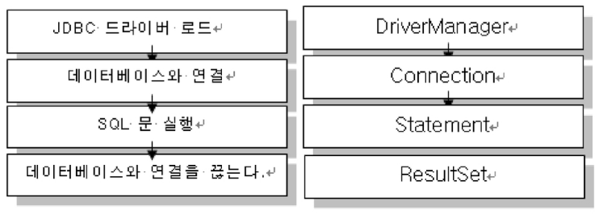

# Java Summary Week 6

## Json
Json파일은 xml보다 가볍게 메타데이터(Metadata)를 보여줄 수 있다.

자바에서는 JsonParser를 이용해 Json을 Json객체로 읽어올 수 있다.

JSONObject와 JSONArray가 있다.

```java
JSONObject parser = new JSONParser();
try{
    JSONObject parse = (JSONObject) parser.parse(new BufferedReader(new InputStreamReader(new FileInputStream("object.jdon"))));
    parse.size();

    JSONArray objs = (JSONArray) parse.get("persons");  // JSON파일에서 persons를 키로 갖는 값을 가져온다.
    // 이후 배열 다루듯 objs를 다루면 된다
}
```

GSON : Google에서 만든 JSON 라이브러리
```java
// 문자열 -> JSON
Gson gson = new Gson();
String jsonString = ""; // JSON형태의 문자열
// 해당 클래스는 getter와 setter를 사용해야 한다.
// getter와 setter가 없으면 작동하지 않는다
Member[] array = gson.fromJson(jsonString, Member[].class)// Member[] 형태로 Json 값들을 넣는다
```

## MYSQL
```sql
-- 데이터베이스 안의 테이블의 구조를 본다
desc (테이블 명);

create table ssafytb(name varchar(10, age int, addr varchar(100),tel varchar(20))); -- ssafytb라는 이름으로 테이블 생성

-- 데이터 삽입
insert into ssafytb(name, age, addr, tel) values('홍길동',21,'광산구','01012345678');   -- values의 값들을 ssafytb 테이블에 삽입

-- 데이터 조회
select name,age,addr,tel from ssafytb;  -- ssafytb의 모든 데이터를 조회
-- where절을 이용한 조건 조회
select name,age,addr,tel from sssafytb where name='김길동' and age>=21
-- 데이터의 수정
update ssafytb set name='김대감', age=55 where age = 31;    -- age가 31인 데이터를 찾아 name은 김대감, age는 55로 수정한다

-- 데이터 삭제
delete from ssafytb where addr='북구'; --addr이 북구인 데이터를 삭제한다.

-- 테이블 삭제
drop table ssafytb;
```

SQL은 colum데이터에 대한 사칙연산이 가능하다
```sql
select salery * 12 ;
-- colum에 별칭을 할당할 수 있다.   as 키워드 사용
select salery * 12 as 연봉;
-- 결과 정렬
-- where절이 끝난 후,
order by (colum 명) (desc);
```

```sql
group by ( key )    -- key를 기준으로 group를 만든다
having condition    -- group by로 집계한 후에 조건을 판단
```

```sql
# SELECT 문의 실행 순서
select Projection   -- 5th
from Table  -- 1st
where condition = condition -- 2nd
group by    -- 3rd
having      -- 4th
order by    -- 6th
```

```sql
# tip
-- 부서별 급여합,평균 급여합이 3천 이상인부서만
SELECT
    deptno, SUM(sal) AS 합, AVG(sal)
FROM
    emp
WHERE 1 -- 쓰는 이유, where절이 필요 없는 문제이나, 이후 where절에 추가를 해야할 경우가 생길경우 이 밑으로 and를 사용가능하다
        -- 이 때 and 문이 필요가 없어졌을 때, 주석처리 하기 편하다 (현장에서 자주 쓴다)
GROUP BY deptno
HAVING SUM(sal) >= 10000
ORDER BY deptno;
```

```sql
# 다중 group by 조건
SELECT
    job, deptno, SUM(sal), AVG(sal)
FROM
    emp
WHERE
    1
GROUP BY job , deptno	-- job으로 grouping 이후 depno로 grouping
ORDER BY JOB;
```

```sql
# with rollup : 마지막 한 줄에 소계를 추가한다
SELECT
    job, SUM(sal), AVG(sal)
FROM
    emp
WHERE
    1
    group by job with rollup;	-- with rollup을 할 경우 전체의 합과 평균을 한줄 더 추가해줌
```

## JDBC API
JDBC(Java Database Connectivity)는 Java 응용프로그램이 관계형 데이터베이스에 접속하기 위한 Java Standard API이다.
- Java를 이용한 데이터베이스 접속과 SQL문장의 실행, 그리고 그 결과로 얻어진 데이터의 핸들링을 제공하는 방법과 절차에 대한 규약이다.
- 개발자는 MySQL, Oracle, MS-SQL Server 데이터베이스 등에 독립적으로 표준화된 하나의 API 사용방법만 숙지하면 된다.

JDBC 프로그래밍
JDBC를 이용해서 데이터베이스에 연결하는 방법은 4단계를 거쳐 진행된다. 각 단계를 진행하는데 사용되는 JDBC클래스는 java.sql 패키지에 포함되어 있다.

